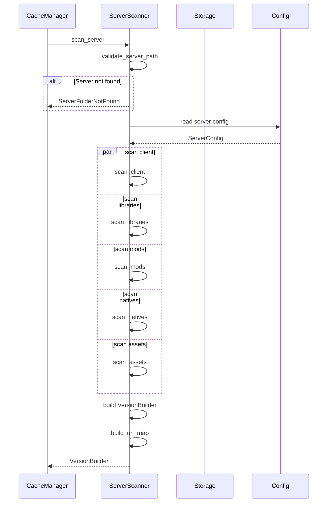
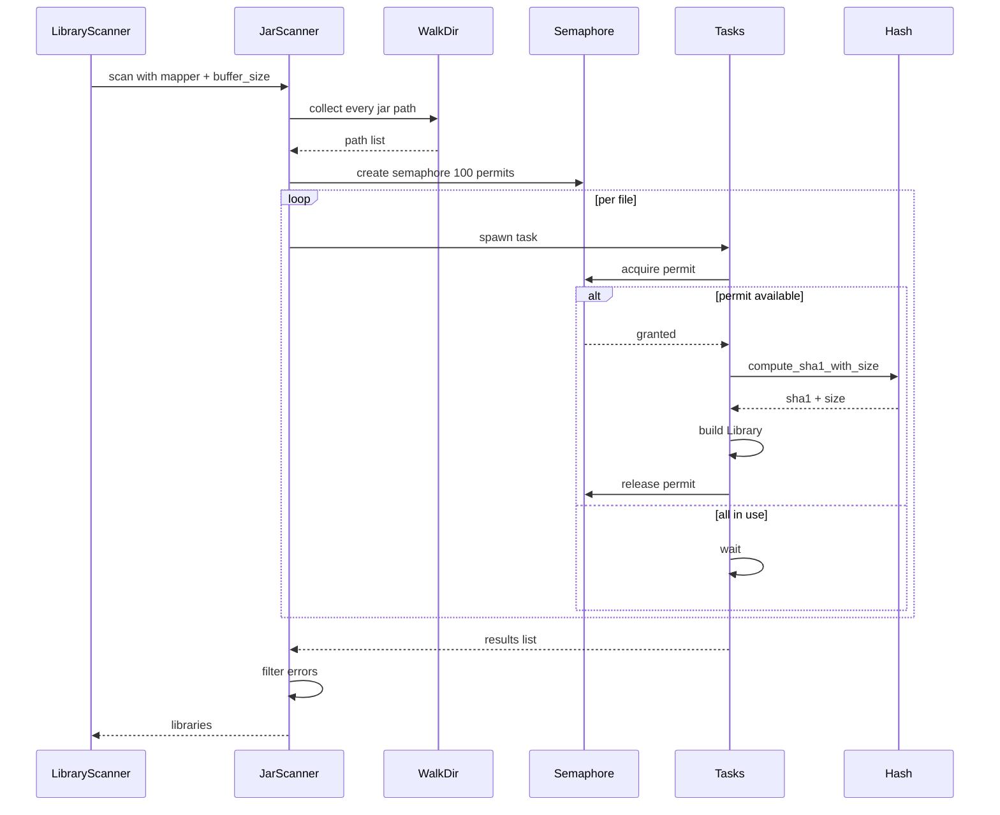
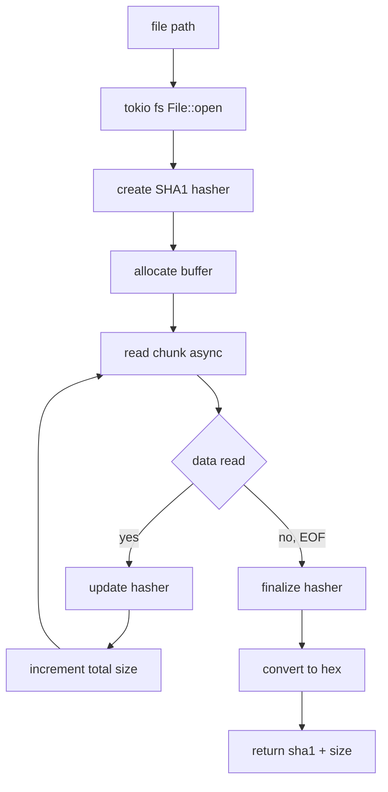
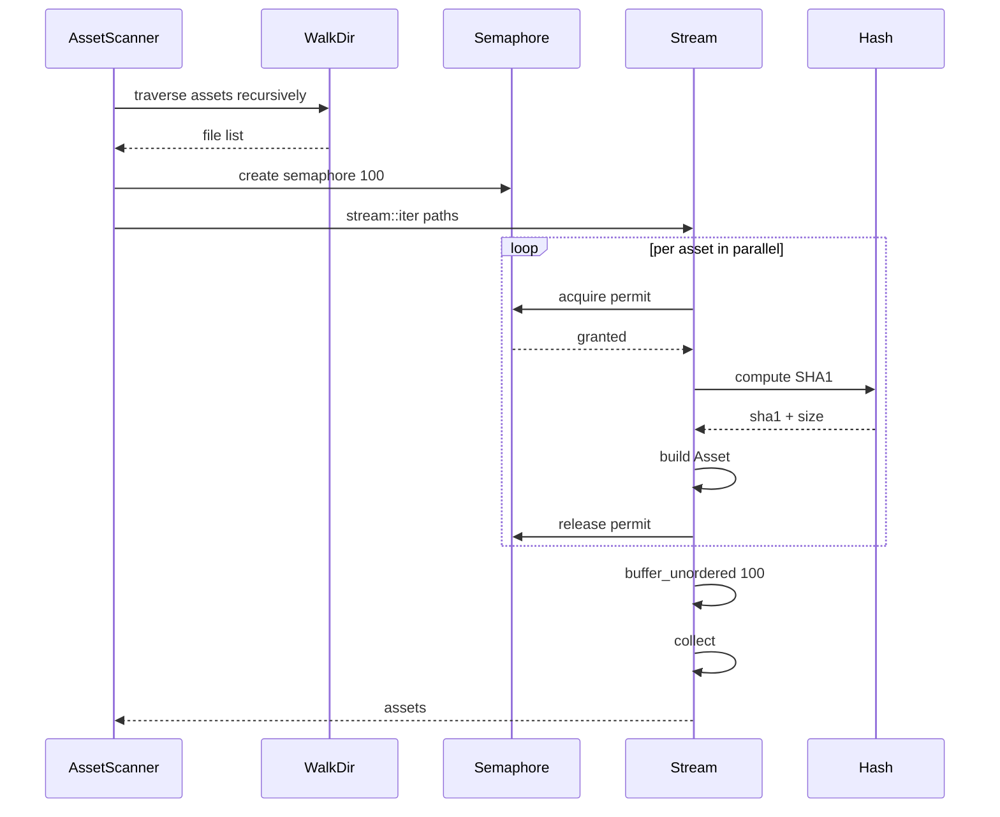
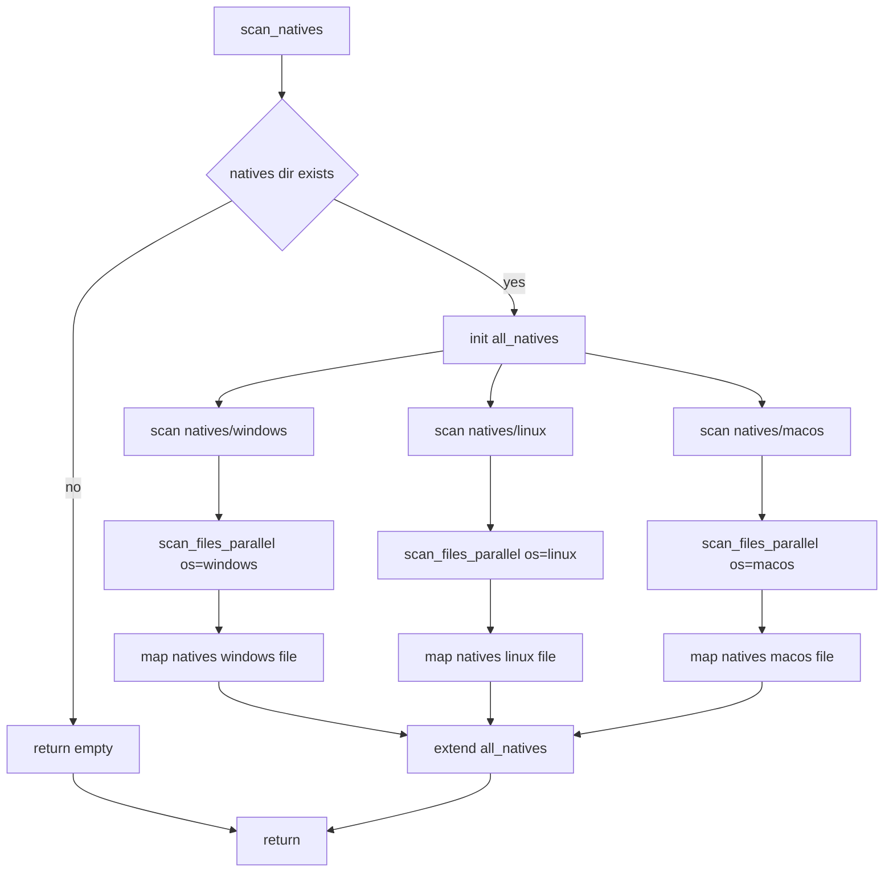
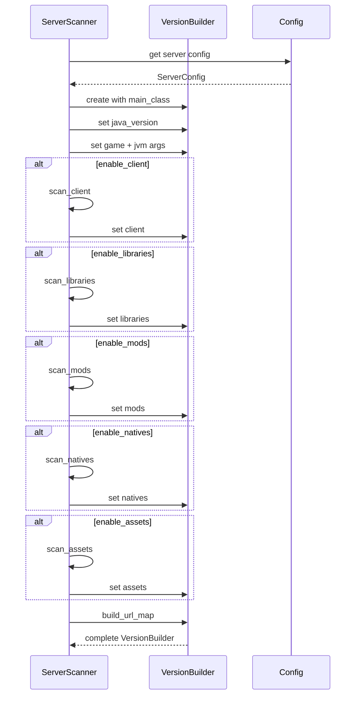

# Flows

## Complete server scan

```mermaid
sequenceDiagram
    participant Cache as CacheManager
    participant SS as ServerScanner
    participant Storage
    participant Config

    Cache->>SS: scan_server
    SS->>SS: validate_server_path
    alt Server not found
        SS-->>Cache: ServerFolderNotFound
    end

    SS->>Config: read server config
    Config-->>SS: ServerConfig

    par scan client
        SS->>SS: scan_client
    and scan libraries
        SS->>SS: scan_libraries
    and scan mods
        SS->>SS: scan_mods
    and scan natives
        SS->>SS: scan_natives
    and scan assets
        SS->>SS: scan_assets
    end

    SS->>SS: build VersionBuilder
    SS->>SS: build_url_map
    SS-->>Cache: VersionBuilder
```

## Parallelised JarScanner

```mermaid
sequenceDiagram
    participant LS as LibraryScanner
    participant JS as JarScanner
    participant WD as WalkDir
    participant Sem as Semaphore
    participant Tasks
    participant Hash

    LS->>JS: scan with mapper + buffer_size
    JS->>WD: collect every jar path
    WD-->>JS: path list

    JS->>Sem: create semaphore 100 permits

    loop per file
        JS->>Tasks: spawn task
        Tasks->>Sem: acquire permit
        alt permit available
            Sem-->>Tasks: granted
            Tasks->>Hash: compute_sha1_with_size
            Hash-->>Tasks: sha1 + size
            Tasks->>Tasks: build Library
            Tasks->>Sem: release permit
        else all in use
            Tasks->>Tasks: wait
        end
    end

    Tasks-->>JS: results list
    JS->>JS: filter errors
    JS-->>LS: libraries
```

## Async hash computation

```mermaid
flowchart TD
    Start[file path] --> Open[tokio fs File::open]
    Open --> Hasher[create SHA1 hasher]
    Hasher --> Buf[allocate buffer]
    Buf --> Read[read chunk async]
    Read --> Check{data read}
    Check -->|yes| Update[update hasher]
    Update --> Add[increment total size]
    Add --> Read
    Check -->|no, EOF| Final[finalize hasher]
    Final --> Hex[convert to hex]
    Hex --> Done[return sha1 + size]
```

## Recursive asset scan

```mermaid
sequenceDiagram
    participant AS as AssetScanner
    participant WD as WalkDir
    participant Sem as Semaphore
    participant Stream
    participant Hash

    AS->>WD: traverse assets recursively
    WD-->>AS: file list

    AS->>Sem: create semaphore 100
    AS->>Stream: stream::iter paths

    loop per asset in parallel
        Stream->>Sem: acquire permit
        Sem-->>Stream: granted
        Stream->>Hash: compute SHA1
        Hash-->>Stream: sha1 + size
        Stream->>Stream: build Asset
        Stream->>Sem: release permit
    end

    Stream->>Stream: buffer_unordered 100
    Stream->>Stream: collect
    Stream-->>AS: assets
```

## Multi-OS native scan

```mermaid
flowchart TD
    Start[scan_natives] --> Check{natives dir exists}
    Check -->|no| Empty[return empty]

    Check -->|yes| Init[init all_natives]
    Init --> Win[scan natives/windows]
    Init --> Lin[scan natives/linux]
    Init --> Mac[scan natives/macos]

    Win --> WinPar[scan_files_parallel os=windows]
    Lin --> LinPar[scan_files_parallel os=linux]
    Mac --> MacPar[scan_files_parallel os=macos]

    WinPar --> WinMap[map natives windows file]
    LinPar --> LinMap[map natives linux file]
    MacPar --> MacMap[map natives macos file]

    WinMap --> Ext[extend all_natives]
    LinMap --> Ext
    MacMap --> Ext

    Empty --> End[return]
    Ext --> End
```

## VersionBuilder construction

```mermaid
sequenceDiagram
    participant SS as ServerScanner
    participant VB as VersionBuilder
    participant Config

    SS->>Config: get server config
    Config-->>SS: ServerConfig

    SS->>VB: create with main_class
    SS->>VB: set java_version
    SS->>VB: set game + jvm args

    alt enable_client
        SS->>SS: scan_client
        SS->>VB: set client
    end
    alt enable_libraries
        SS->>SS: scan_libraries
        SS->>VB: set libraries
    end
    alt enable_mods
        SS->>SS: scan_mods
        SS->>VB: set mods
    end
    alt enable_natives
        SS->>SS: scan_natives
        SS->>VB: set natives
    end
    alt enable_assets
        SS->>SS: scan_assets
        SS->>VB: set assets
    end

    SS->>VB: build_url_map
    VB-->>SS: complete VersionBuilder
```

## Performance notes

- Sequential scan of N files: O(N * T) where T = hash time.
- Parallel with batch size B: O(N / B * T) theoretical, bounded by
  disk I/O in practice.
