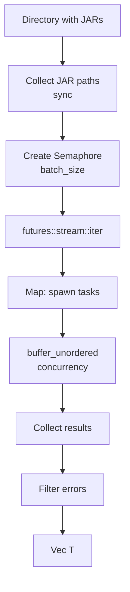
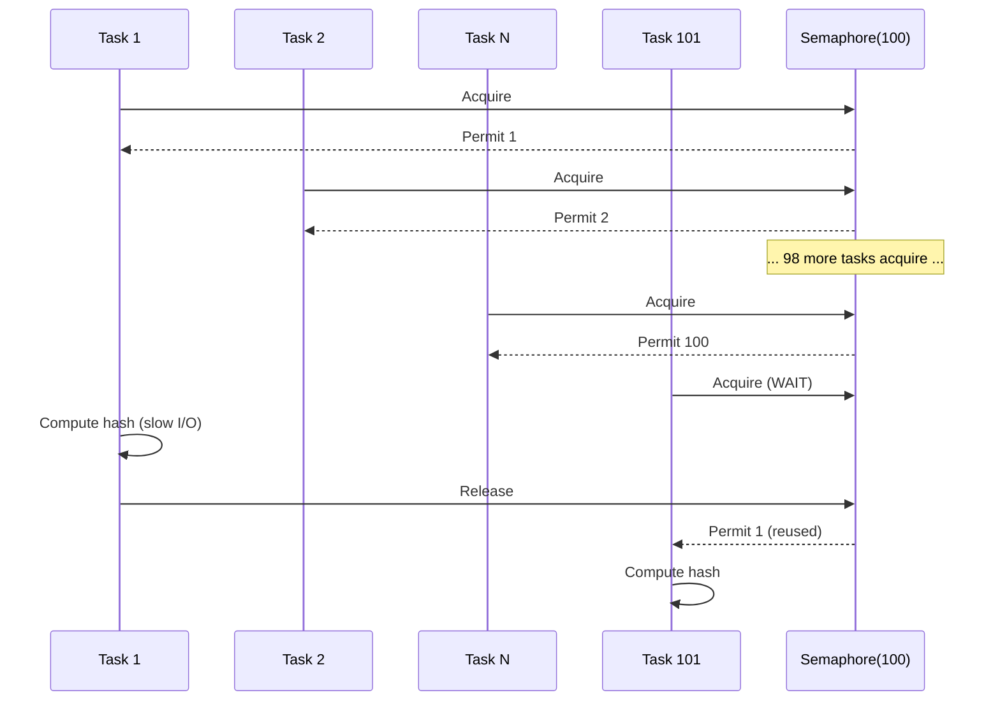

# JarScanner - Scanner generique parallelise

## Vue d'ensemble

`JarScanner` est un scanner generique reutilisable pour les fichiers JAR avec parallelisation controlee. Il est utilise par LibraryScanner et ModScanner.

## Architecture



## Implementation

### Structure

```rust
pub struct JarScanner {
    pub base_dir: PathBuf,       // Dossier a scanner
    pub server: String,           // Nom du serveur
    pub storage: Arc<dyn StorageBackend>,  // Backend de stockage
    pub batch_size: usize,        // Nombre de taches paralleles
}
```

### Methode scan

**Signature**:
```rust
pub async fn scan<T, F>(self, mapper: F, buffer_size: usize) -> Result<Vec<T>>
where
    T: Send + 'static,
    F: Fn(JarFileInfo) -> Result<T> + Send + Sync + 'static,
```

**Parametres generiques**:
- `T`: Type de retour (Library, Mod, etc.)
- `F`: Fonction de mapping JarFileInfo → T

**Processus**:

1. **Collection des paths** (synchrone):
```rust
let jar_paths: Vec<PathBuf> = WalkDir::new(&self.base_dir)
    .into_iter()
    .filter_map(|e| e.ok())
    .filter(|e| is_jar_file(e.path()))
    .map(|e| e.path().to_path_buf())
    .collect();
```

2. **Creation du semaphore**:
```rust
let semaphore = Arc::new(Semaphore::new(self.batch_size));
```

3. **Traitement parallele**:
```rust
let results: Vec<Result<T>> = stream::iter(jar_paths)
    .map(|jar_path| {
        let _permit = sem.acquire().await.unwrap();
        // Compute hash
        // Call mapper
    })
    .buffer_unordered(self.batch_size)
    .collect()
    .await;
```

4. **Filtrage des erreurs**:
```rust
Ok(results.into_iter().filter_map(|r| r.ok()).collect())
```

## JarFileInfo

Structure d'information sur un fichier JAR scanne:

```rust
pub struct JarFileInfo {
    pub file_name: String,           // "library-1.0.0.jar"
    pub relative_path: PathBuf,      // "com/example/library/1.0.0/library-1.0.0.jar"
    pub url: String,                 // "https://cdn.example.com/..."
    pub url_path: String,            // "com/example/library/1.0.0/library-1.0.0.jar"
    pub sha1: String,                // "a1b2c3d4..."
    pub size: u64,                   // 1234567
}
```

## Exemples d'utilisation

### LibraryScanner

```rust
let scanner = JarScanner::new(
    libraries_dir,
    server.to_string(),
    Arc::clone(storage),
    batch_size,
);

scanner.scan(|info| {
    let maven_name = path_to_maven_name(&info.relative_path);
    Ok(Library {
        name: maven_name,
        url: Some(info.url),
        path: Some(info.url_path),
        sha1: Some(info.sha1),
        size: Some(info.size),
    })
}, buffer_size).await
```

### ModScanner

```rust
let scanner = JarScanner::new(
    mods_dir,
    server.to_string(),
    Arc::clone(storage),
    batch_size,
);

scanner.scan(|info| {
    Ok(Mod {
        name: info.file_name,  // Pas de conversion Maven
        url: Some(info.url),
        path: Some(info.url_path),
        sha1: Some(info.sha1),
        size: Some(info.size),
    })
}, buffer_size).await
```

## Optimisations

### Semaphore pour controle de concurrence



**Avantage**: Limite la charge systeme, evite OOM et thrashing disque.

### buffer_unordered

```rust
.buffer_unordered(batch_size)
```

**Comportement**:
- Execute jusqu'a `batch_size` futures simultanement
- Collecte les resultats des qu'ils sont prets (pas d'ordre)
- Maximise le throughput

**Difference avec buffer**:
- `buffer`: Preserve l'ordre (moins performant)
- `buffer_unordered`: Meilleure performance, ordre non garanti

### Collection eagere des paths

**Pourquoi**:
- WalkDir est synchrone (bloquant)
- Separation sync/async pour efficacite
- Permet de connaitre le nombre total de fichiers

**Alternative (mauvaise)**:
```rust
// Ne PAS faire:
for entry in WalkDir::new(&dir) {
    tokio::spawn(async move {
        // Mixing sync iterator with async tasks
    });
}
```

## Gestion des erreurs

### Resilience aux erreurs individuelles

```rust
let results: Vec<Result<T>> = stream::iter(jar_paths)
    .map(|path| async { /* peut echouer */ })
    .buffer_unordered(batch_size)
    .collect()
    .await;

// Filtre les erreurs
Ok(results.into_iter().filter_map(|r| r.ok()).collect())
```

**Impact**:
- Fichier corrompu: Ignore, continue
- Erreur de permission: Ignore, continue
- Hash impossible a calculer: Ignore, continue

**Logging**: Erreurs loggees mais pas propagees.

### Cas d'echec complet

Le scan echoue completement si:
- Dossier de base n'existe pas → retourne `Ok(vec![])` (vide)
- Storage backend inaccessible → Erreur propagee
- Panic d'une tache → JoinError propage

## Performance

### Metriques

**Configuration**: batch_size = 100, buffer_size = 8KB

**Libraries** (200 fichiers, 50MB total):
- Temps sequential estime: 20s
- Temps parallele mesure: 3-5s
- Speedup: 4-7x

**Mods** (50 fichiers, 200MB total):
- Temps sequential estime: 15s
- Temps parallele mesure: 2-3s
- Speedup: 5-7x

### Facteurs limitants

1. **I/O disque**: SSD vs HDD fait une grande difference
2. **CPU**: Calcul SHA1 intensif
3. **Semaphore**: Trop petit = sous-utilisation, trop grand = thrashing
4. **Buffer size**: 8KB optimal pour la plupart des fichiers
