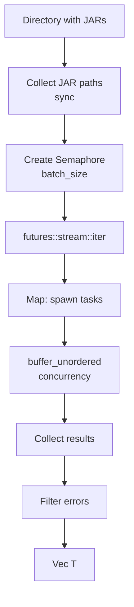
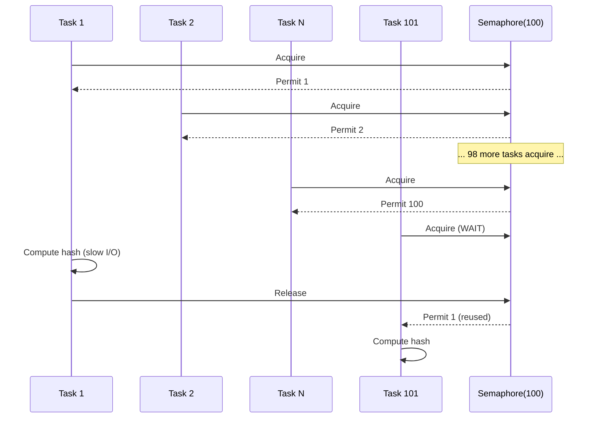

# JarScanner - Parallelized generic scanner

## Overview

`JarScanner` is a reusable generic scanner for JAR files with controlled parallelization. It is used by LibraryScanner and ModScanner.

## Architecture



## Implementation

### Structure

```rust
pub struct JarScanner {
    pub base_dir: PathBuf,       // Directory to scan
    pub server: String,           // Server name
    pub storage: Arc<dyn StorageBackend>,  // Storage backend
    pub batch_size: usize,        // Number of parallel tasks
}
```

### scan method

**Signature**:
```rust
pub async fn scan<T, F>(self, mapper: F, buffer_size: usize) -> Result<Vec<T>>
where
    T: Send + 'static,
    F: Fn(JarFileInfo) -> Result<T> + Send + Sync + 'static,
```

**Generic parameters**:
- `T`: Return type (Library, Mod, etc.)
- `F`: JarFileInfo → T mapping function

**Process**:

1. **Path collection** (synchronous):
```rust
let jar_paths: Vec<PathBuf> = WalkDir::new(&self.base_dir)
    .into_iter()
    .filter_map(|e| e.ok())
    .filter(|e| is_jar_file(e.path()))
    .map(|e| e.path().to_path_buf())
    .collect();
```

2. **Semaphore creation**:
```rust
let semaphore = Arc::new(Semaphore::new(self.batch_size));
```

3. **Parallel processing**:
```rust
let results: Vec<Result<T>> = stream::iter(jar_paths)
    .map(|jar_path| {
        let _permit = sem.acquire().await.unwrap();
        // Compute hash
        // Call mapper
    })
    .buffer_unordered(self.batch_size)
    .collect()
    .await;
```

4. **Error filtering**:
```rust
Ok(results.into_iter().filter_map(|r| r.ok()).collect())
```

## JarFileInfo

Information structure about a scanned JAR file:

```rust
pub struct JarFileInfo {
    pub file_name: String,           // "library-1.0.0.jar"
    pub relative_path: PathBuf,      // "com/example/library/1.0.0/library-1.0.0.jar"
    pub url: String,                 // "https://cdn.example.com/..."
    pub url_path: String,            // "com/example/library/1.0.0/library-1.0.0.jar"
    pub sha1: String,                // "a1b2c3d4..."
    pub size: u64,                   // 1234567
}
```

## Usage examples

### LibraryScanner

```rust
let scanner = JarScanner::new(
    libraries_dir,
    server.to_string(),
    Arc::clone(storage),
    batch_size,
);

scanner.scan(|info| {
    let maven_name = path_to_maven_name(&info.relative_path);
    Ok(Library {
        name: maven_name,
        url: Some(info.url),
        path: Some(info.url_path),
        sha1: Some(info.sha1),
        size: Some(info.size),
    })
}, buffer_size).await
```

### ModScanner

```rust
let scanner = JarScanner::new(
    mods_dir,
    server.to_string(),
    Arc::clone(storage),
    batch_size,
);

scanner.scan(|info| {
    Ok(Mod {
        name: info.file_name,  // No Maven conversion
        url: Some(info.url),
        path: Some(info.url_path),
        sha1: Some(info.sha1),
        size: Some(info.size),
    })
}, buffer_size).await
```

## Optimizations

### Semaphore for concurrency control



**Advantage**: Limits system load, prevents OOM and disk thrashing.

### buffer_unordered

```rust
.buffer_unordered(batch_size)
```

**Behavior**:
- Executes up to `batch_size` futures simultaneously
- Collects results as soon as they are ready (no ordering)
- Optimizes parallelization

**Difference with buffer**:
- `buffer`: Preserves order (less performant)
- `buffer_unordered`: Better performance, order not guaranteed

### Eager path collection

**Why**:
- WalkDir is synchronous (blocking)
- Sync/async separation for efficiency
- Allows knowing the total number of files

**Alternative (bad)**:
```rust
// DO NOT do this:
for entry in WalkDir::new(&dir) {
    tokio::spawn(async move {
        // Mixing sync iterator with async tasks
    });
}
```

## Error handling

### Resilience to individual errors

```rust
let results: Vec<Result<T>> = stream::iter(jar_paths)
    .map(|path| async { /* can fail */ })
    .buffer_unordered(batch_size)
    .collect()
    .await;

// Filter errors
Ok(results.into_iter().filter_map(|r| r.ok()).collect())
```

**Impact**:
- Corrupted file: Ignore, continue
- Permission error: Ignore, continue
- Hash impossible to compute: Ignore, continue

**Logging**: Errors are logged but not propagated.

### Complete failure cases

The scan fails completely if:
- Base directory does not exist → returns `Ok(vec![])` (empty)
- Storage backend inaccessible → Error propagated
- Task panic → JoinError propagated

## Performance

### Limiting factors

1. **Disk I/O**: SSD vs HDD makes a big difference
2. **CPU**: Intensive SHA1 computation
3. **Semaphore**: Too small = underutilization, too large = thrashing
4. **Buffer size**: 8KB optimal for most files
