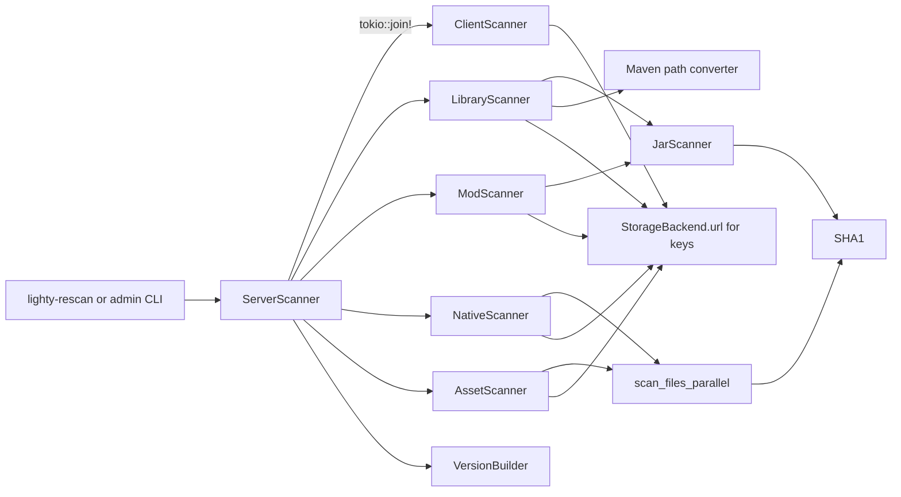

# Overview

`lighty-scanner` walks a server's working directory on disk and turns
it into a `VersionBuilder`. It is stateless: no cache, no background
tasks, no I/O outside the call. `lighty-rescan` calls it on a timer
(or on every file-watcher event) to refresh the snapshot held in the
version cache.

## What's inside

| Module / type | Purpose |
|---|---|
| `ServerScanner` | Entry point; orchestrates per-component scans. |
| `ServerScanner::scan_server` | Loud variant — failures bubble up as `ScanError`. Used at boot and from the admin CLI. |
| `ServerScanner::scan_server_silent` | Quiet variant — missing files / transient errors are absorbed. Used by the continuous rescan loop. |
| Specialized scanners (`ClientScanner`, `LibraryScanner`, `ModScanner`, `NativeScanner`, `AssetScanner`) | Per-file-type implementations. Run in parallel via `tokio::join!`. |
| `JarScanner` | Shared JAR-walker (used by `LibraryScanner` and `ModScanner`). |
| `ScanError` | One enum, surfaced on `RescanError` via `#[from]`. |

## High-level shape

`tokio::join!` keeps the per-component work concurrent; inside each
component, file hashing is parallelised with rayon's `par_iter`.

## Design notes

- **Loud vs silent** is the only real difference between the two
  entry points: silent swallows scan errors and returns `Err`
  anyway (`lighty-rescan` ignores the result), loud surfaces them so
  the operator (or the admin endpoint) can react.
- **No URL map rebuild.** `ServerScanner` does not call
  `VersionBuilder::build_url_map`. That step is the rescan crate's
  responsibility, because it can choose between the full rebuild
  (first scan) and the incremental `apply_to_url_map` (diff-driven
  update).
- **Storage backend is read-only here.** Scanners use it only to
  derive public URLs for the `VersionBuilder` entries; they never
  upload or delete.

## See also

- [`how-to-use.md`](./how-to-use.md) — invoke the scanner
- [`exports.md`](./exports.md) — full public surface
- [`architecture.md`](./architecture.md) — per-component breakdown
- [`flow.md`](./flow.md) — sequence diagrams already in the crate
- [`jar-scanner.md`](./jar-scanner.md) — JAR-specific details
- [`../../rescan/docs/flows.md`](../../rescan/docs/flows.md) — how
  `scan_server_silent` and `scan_server` fit in the rescan pipeline
