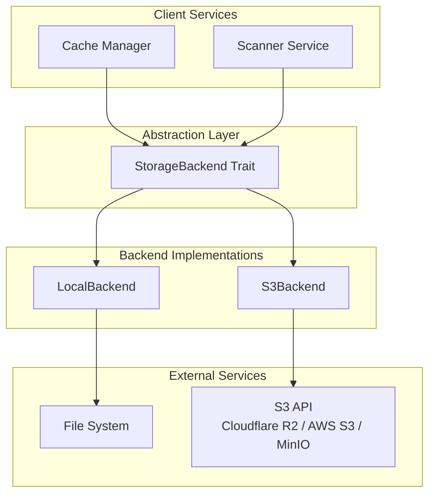
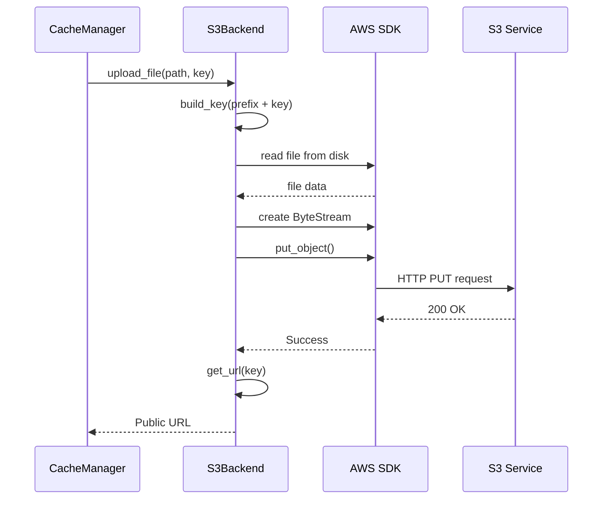
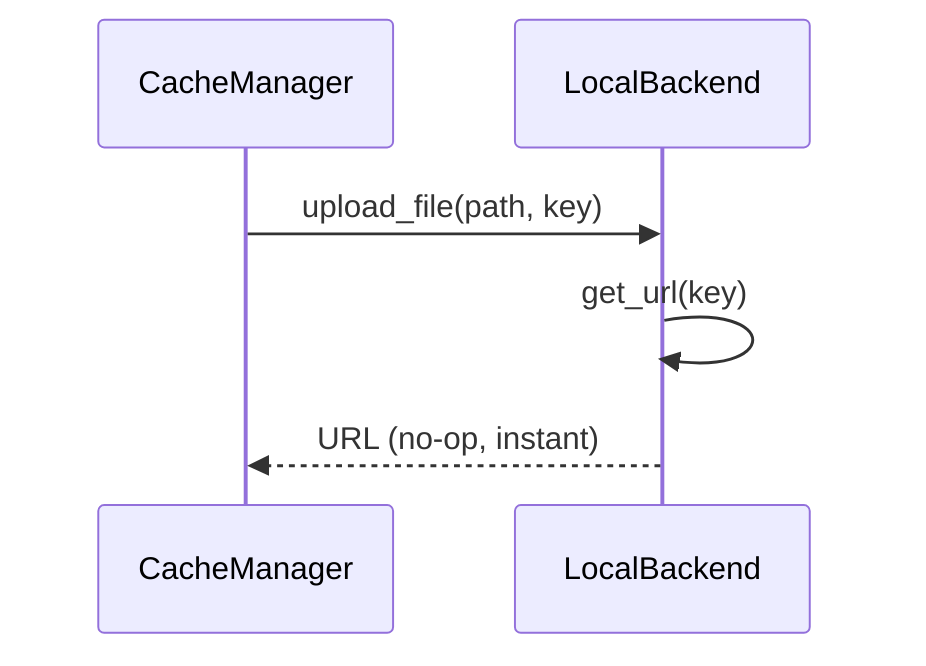
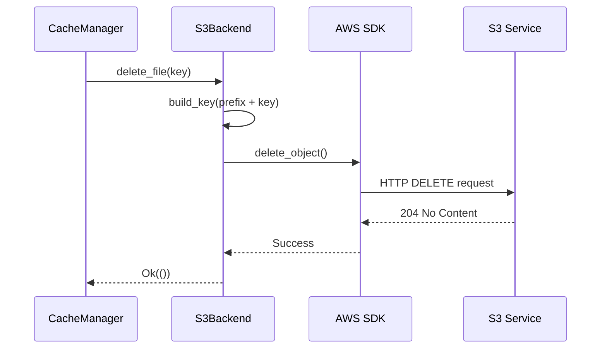

# Storage System Architecture

## Overview

The storage system is designed as a multi-backend abstraction allowing support for different file distribution strategies without changing business code.

## Architecture Diagram

## Main Components

### StorageBackend Trait

Common interface defining the contract that all backends must respect.

**Operations:**
- `upload_file`: Upload a file to the storage backend
- `delete_file`: Delete a file from the backend
- `get_url`: Generate the public URL to access a file
- `is_remote`: Indicates if the backend is remote or local

**Constraints:**
- `Send + Sync`: Allows use in async multi-thread context
- Asynchronous operations for all I/O
- Error handling via `Result<T, StorageError>`

### LocalBackend

Implementation for local disk storage.

**Features:**
- No actual upload operation (files already in place)
- URL generation pointing to local HTTP server
- Delete operations are no-ops (files managed by scanner)
- Maximum performance (no network transfer)

**Configuration:**
- `base_url`: HTTP server base URL
- `base_path`: Root path for files (not actively used)

**Use Cases:**
- Local development and testing
- Monolithic deployments
- Situations where cloud storage is not necessary

### S3Backend

Implementation for S3-compatible storage.

**Features:**
- Full S3 API support
- Asynchronous upload with streaming
- Bucket prefix support
- Compatible with multiple providers

**Configuration:**
- `endpoint_url`: S3 endpoint URL
- `region`: AWS region or equivalent
- `access_key_id`: Access key
- `secret_access_key`: Secret key
- `bucket_name`: Bucket name
- `public_url`: Public URL to access files
- `bucket_prefix`: Optional prefix to organize files

**Supported Providers:**
- Cloudflare R2
- AWS S3
- MinIO
- DigitalOcean Spaces
- Any S3-compatible service

## Data Flow

### File Upload (S3Backend)

### File Upload (LocalBackend)

### File Deletion (S3Backend)

## Design Patterns

### Strategy Pattern

The system uses the Strategy pattern via the `StorageBackend` trait:
- Storage algorithm is encapsulated in separate implementations
- Client uses the interface without knowing the implementation
- Backends are interchangeable at runtime

### Async/Await

All I/O operations use async/await:
- Upload and delete are async operations
- Using Tokio for async runtime
- Optimal performance with native concurrency

### Builder Pattern (S3Backend)

S3 client construction uses the builder pattern:
- Progressive configuration with AWS SDK
- Parameter validation at construction
- Immutability after creation

## Optimizations

### S3Backend

**ByteStream for uploads:**
- Asynchronous file reading
- Streaming to S3 without loading everything in memory
- Supports arbitrary file sizes

**Prefix caching:**
- Prefix is pre-calculated and stored
- Avoids repeated concatenations
- O(1) lookup for build_key

**Connection pooling:**
- AWS SDK client maintains a connection pool
- HTTP connection reuse
- Reduced latency

### LocalBackend

**Zero-copy:**
- No physical upload operation
- No file copying
- URL generation only

**No-op operations:**
- Upload returns immediately
- Delete does nothing (files managed elsewhere)
- Maximum performance

## Error Handling

The system propagates errors via the `StorageError` type:
- Automatic conversion from underlying errors
- Descriptive error messages with context
- Integration with logging system

## Extensibility

To add a new backend:

1. Implement the `StorageBackend` trait
2. Handle upload/delete/get_url operations
3. Implement `is_remote()` correctly
4. Add necessary error types to `StorageError`
5. Document backend specifics

The system is designed to facilitate adding new backends without modifying existing code.
