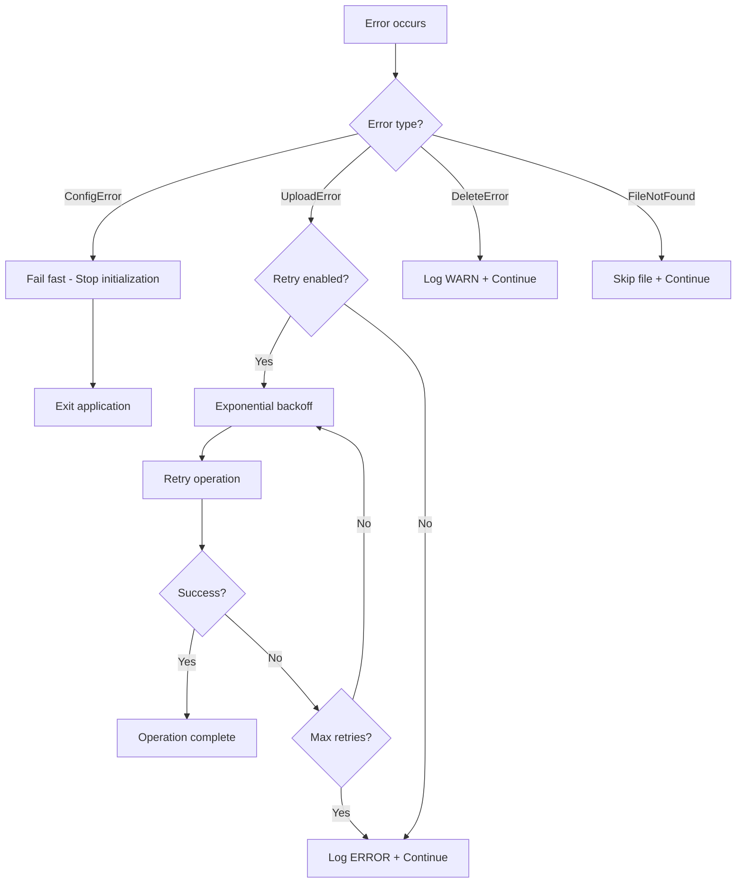
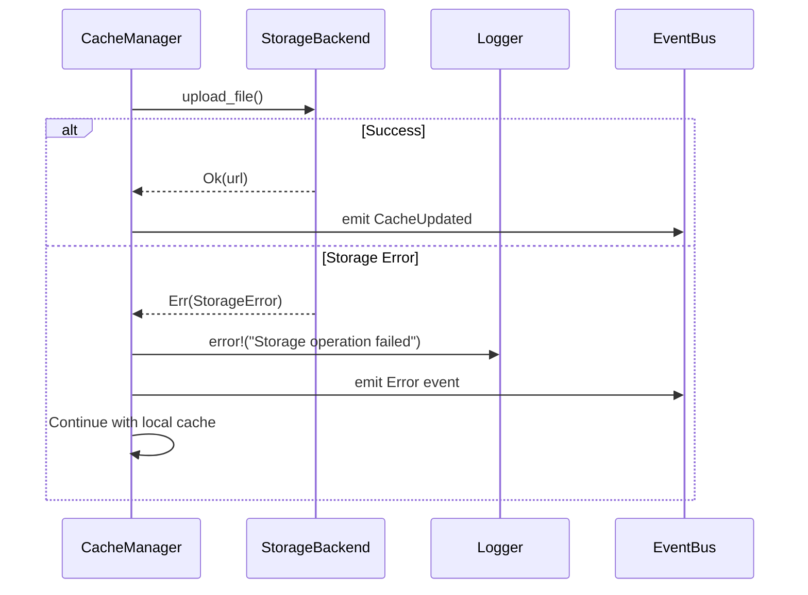

# Error Documentation

This document describes the different error types handled by the `storage` crate.

## Main Type: StorageError

The `StorageError` type is an enumeration that groups all possible storage system errors. It uses `thiserror` for idiomatic error handling in Rust.

## Error Types

### IoError

```rust
#[error("I/O error: {0}")]
IoError(#[from] std::io::Error)
```

**Description**: Input/output error during file read or write operations.

**Possible Causes**:
- File not found during upload
- Insufficient permissions on local file
- Disk full during read
- Network error when accessing remote filesystem

**Context of Occurrence**:
- S3Backend: Reading local file before upload
- LocalBackend: Checking file existence
- Pre-upload verification operations

**Handling**: Error is automatically propagated thanks to `#[from]`. The system logs the error with the concerned file path.

---

### S3SdkError

```rust
#[cfg(feature = "s3")]
#[error("S3 SDK error: {0}")]
S3SdkError(String)
```

**Description**: Error from the AWS S3 SDK.

**Possible Causes**:
- Invalid or expired credentials
- Inaccessible S3 endpoint
- Network timeout
- S3 response parsing error
- S3 service temporarily unavailable

**Context of Occurrence**:
- S3 client configuration during initialization
- put_object and delete_object operations
- Communication with S3 API

**Handling**: SDK error is converted to String for storage. Original message is preserved for debugging.

---

### UploadError

```rust
#[error("Upload failed for '{0}': {1}")]
UploadError(String, String)
```

**Description**: Error during file upload to storage backend.

**Parameters**:
- First parameter: File key (relative path)
- Second parameter: Detailed error message

**Possible Causes**:
- Failed connection to S3 service
- Non-existent or inaccessible bucket
- Storage quota exceeded
- File too large
- Network interruption during upload

**Context of Occurrence**:
- S3Backend::upload_file during put_object
- Conversion from SdkError during upload failure
- Failed pre-upload validation

**Handling**: Error is logged with ERROR level including file key. Cloud synchronization operation can be retried or ignored depending on configuration.

---

### DeleteError

```rust
#[error("Delete failed for '{0}': {1}")]
DeleteError(String, String)
```

**Description**: Error during file deletion from storage backend.

**Parameters**:
- First parameter: File key to delete
- Second parameter: Detailed error message

**Possible Causes**:
- File already deleted (race condition)
- Insufficient permissions on bucket
- S3 service temporarily unavailable
- Invalid or malformed key

**Context of Occurrence**:
- S3Backend::delete_file during delete_object
- Cleanup of obsolete files
- Synchronization of deletions to cloud

**Handling**: Error is logged with a warning. Deletion can be ignored if file no longer exists (idempotence).

---

### ConfigError

```rust
#[error("Invalid storage configuration: {0}")]
ConfigError(String)
```

**Description**: Invalid storage backend configuration.

**Possible Causes**:
- Missing or invalid S3 credentials
- Malformed endpoint URL
- Empty or invalid bucket name
- Unsupported region
- Invalid public URL

**Context of Occurrence**:
- S3Backend initialization
- Configuration parameter validation
- S3 client creation

**Handling**: Error is fatal and prevents backend initialization. System must be correctly configured before starting.

---

### FileNotFound

```rust
#[error("File not found: {0}")]
FileNotFound(String)
```

**Description**: Local file not found during upload operation.

**Parameters**:
- Complete path of missing file

**Possible Causes**:
- File deleted between scan and upload
- Incorrect path in request
- Race condition during scan
- File moved by external process

**Context of Occurrence**:
- Pre-upload validation in S3Backend
- Upload of added or modified files
- Synchronization operations

**Handling**: Error is logged with a warning. File is ignored and synchronization continues for other files.

---

## Error Handling Strategy

### Resilience Principle

The storage system is designed to be resilient:
- Upload errors don't prevent local cache functioning
- Delete errors are tolerated (idempotence)
- Configuration errors are detected early (fail-fast)

### Severity Levels

**CRITICAL**: Errors preventing initialization
- ConfigError with invalid credentials
- Inaccessible S3 endpoint at startup

**ERROR**: Errors on important operations
- UploadError for critical files
- IoError when reading files

**WARN**: Errors on tolerable operations
- DeleteError for already deleted file
- FileNotFound for temporary file

**INFO**: Normal operations
- Successful upload
- Successful delete

### Error Propagation



### Recovery Strategies

**Automatic retry**:
- UploadError: Retry with exponential backoff (max 3 attempts)
- S3SdkError: Retry if transient error (timeout, 503)
- IoError: Retry once after short delay

**Graceful degradation**:
- Upload fails: Local cache continues functioning
- Delete fails: File remains on cloud (can be cleaned later)
- S3 unavailable: Fallback to LocalBackend if configured

**Fail-fast**:
- ConfigError: Stop initialization immediately
- Invalid credentials: Don't start service
- Inaccessible endpoint: Error at startup

### Logging and Monitoring

Each error type generates structured logs:

```rust
// UploadError
tracing::error!(
    file = %key,
    error = %err,
    "Upload failed"
);

// DeleteError
tracing::warn!(
    file = %key,
    error = %err,
    "Delete failed, continuing"
);

// ConfigError
tracing::error!(
    config = ?config,
    error = %err,
    "Invalid storage configuration"
);
```

### Idempotence

Operations are designed to be idempotent:

**Upload**:
- Re-uploading same file replaces the old one
- Same content = same result
- No side effects if failure then retry

**Delete**:
- Deleting an already deleted file returns success
- DeleteError ignored if file doesn't exist
- Operation repeatable without negative effects

## Integration with Rest of System

### Error Conversion

The system automatically converts errors from dependencies:

```rust
// From std::io::Error
impl From<std::io::Error> for StorageError {
    fn from(err: std::io::Error) -> Self {
        Self::IoError(err)
    }
}

// From AWS SDK errors (manual)
match sdk_result {
    Err(e) => Err(StorageError::UploadError(key, e.to_string())),
    Ok(v) => Ok(v),
}
```

### Propagation to CacheManager



### Error Metrics

The system collects error metrics:
- Error rate by type
- Success rate after retry
- Distribution of error causes
