# Storage System Processing Flow

## Overview

This document details the execution flows for each storage system operation, with sequence diagrams illustrating interactions between components.

## Initialization

### LocalBackend Creation

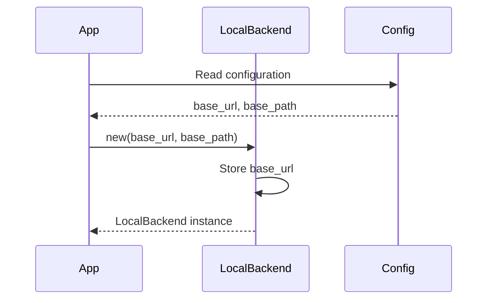
```mermaid
sequenceDiagram
    participant App
    participant LB as LocalBackend
    participant Config

    App->>Config: Read configuration
    Config-->>App: base_url, base_path
    App->>LB: new(base_url, base_path)
    LB->>LB: Store base_url
    LB-->>App: LocalBackend instance
```

### S3Backend Creation

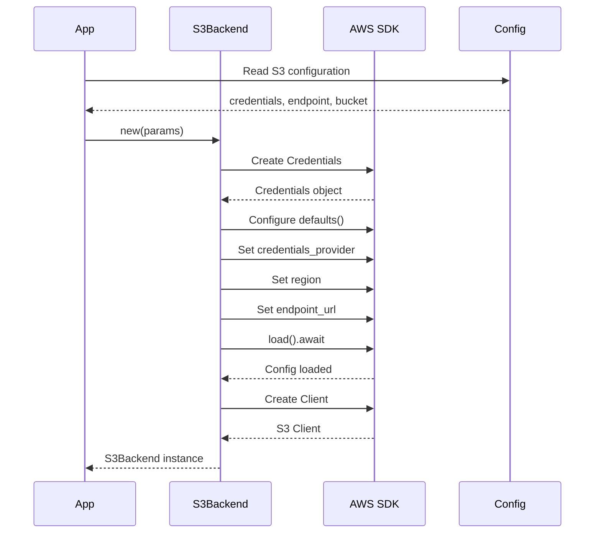
```mermaid
sequenceDiagram
    participant App
    participant S3B as S3Backend
    participant SDK as AWS SDK
    participant Config

    App->>Config: Read S3 configuration
    Config-->>App: credentials, endpoint, bucket
    App->>S3B: new(params)
    S3B->>SDK: Create Credentials
    SDK-->>S3B: Credentials object
    S3B->>SDK: Configure defaults()
    S3B->>SDK: Set credentials_provider
    S3B->>SDK: Set region
    S3B->>SDK: Set endpoint_url
    S3B->>SDK: load().await
    SDK-->>S3B: Config loaded
    S3B->>SDK: Create Client
    SDK-->>S3B: S3 Client
    S3B-->>App: S3Backend instance
```

## Storage Operations

### Upload - LocalBackend

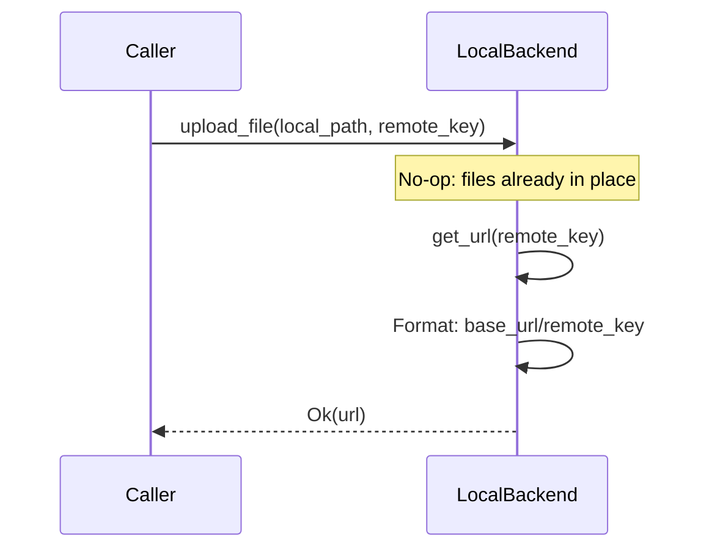
```mermaid
sequenceDiagram
    participant Caller
    participant LB as LocalBackend

    Caller->>LB: upload_file(local_path, remote_key)
    Note over LB: No-op: files already in place
    LB->>LB: get_url(remote_key)
    LB->>LB: Format: base_url/remote_key
    LB-->>Caller: Ok(url)
```

**Performance:** O(1) - Instant operation

### Upload - S3Backend

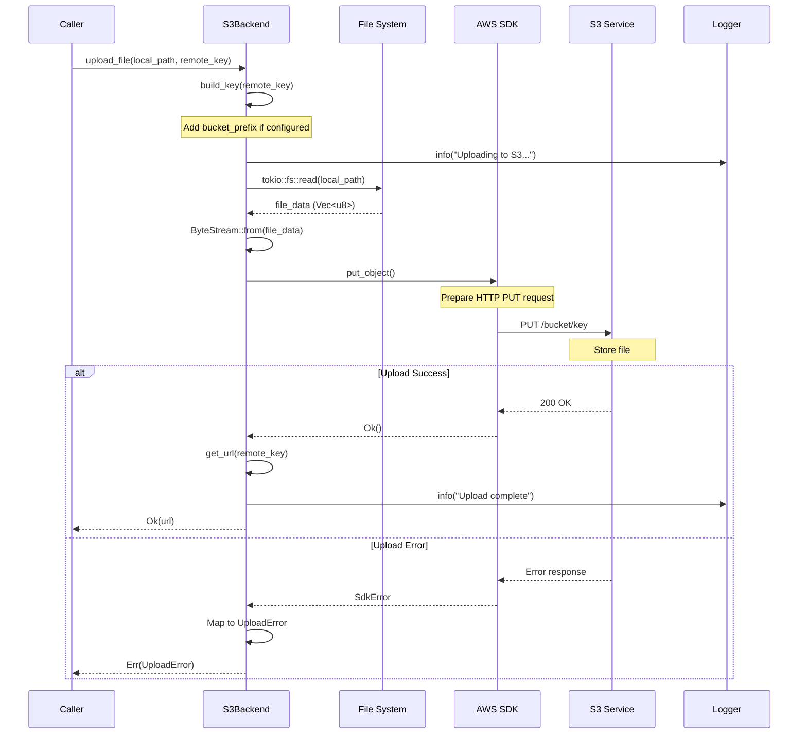
```mermaid
sequenceDiagram
    participant Caller
    participant S3B as S3Backend
    participant FS as File System
    participant SDK as AWS SDK
    participant S3 as S3 Service
    participant Log as Logger

    Caller->>S3B: upload_file(local_path, remote_key)
    S3B->>S3B: build_key(remote_key)
    Note over S3B: Add bucket_prefix if configured
    S3B->>Log: info("Uploading to S3...")
    S3B->>FS: tokio::fs::read(local_path)
    FS-->>S3B: file_data (Vec<u8>)
    S3B->>S3B: ByteStream::from(file_data)

    S3B->>SDK: put_object()
    Note over SDK: Prepare HTTP PUT request
    SDK->>S3: PUT /bucket/key
    Note over S3: Store file

    alt Upload Success
        S3-->>SDK: 200 OK
        SDK-->>S3B: Ok()
        S3B->>S3B: get_url(remote_key)
        S3B->>Log: info("Upload complete")
        S3B-->>Caller: Ok(url)
    else Upload Error
        S3-->>SDK: Error response
        SDK-->>S3B: SdkError
        S3B->>S3B: Map to UploadError
        S3B-->>Caller: Err(UploadError)
    end
```

**Performance:** O(n) where n = file size

### Deletion - LocalBackend

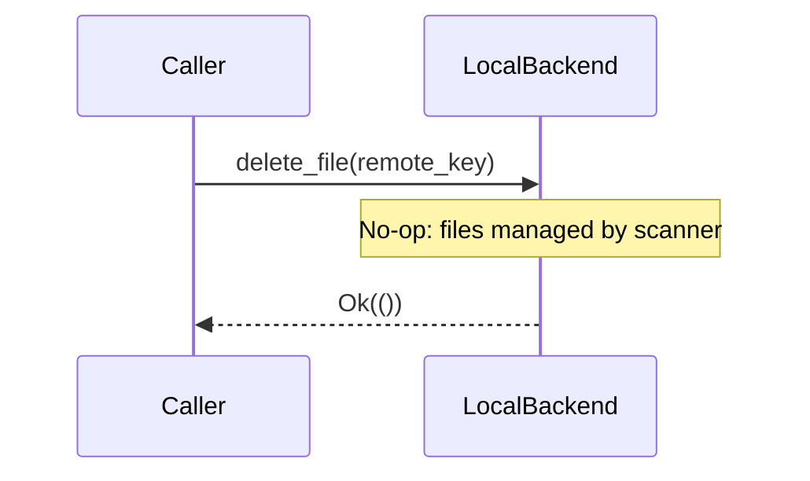
```mermaid
sequenceDiagram
    participant Caller
    participant LB as LocalBackend

    Caller->>LB: delete_file(remote_key)
    Note over LB: No-op: files managed by scanner
    LB-->>Caller: Ok(())
```

**Performance:** O(1) - Instant operation

### Deletion - S3Backend

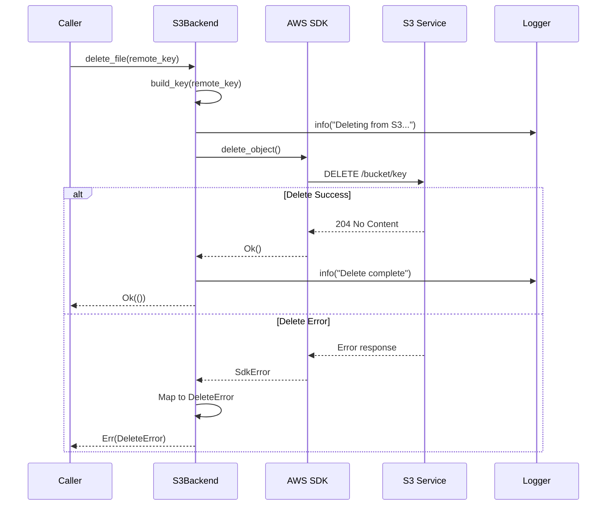
```mermaid
sequenceDiagram
    participant Caller
    participant S3B as S3Backend
    participant SDK as AWS SDK
    participant S3 as S3 Service
    participant Log as Logger

    Caller->>S3B: delete_file(remote_key)
    S3B->>S3B: build_key(remote_key)
    S3B->>Log: info("Deleting from S3...")
    S3B->>SDK: delete_object()
    SDK->>S3: DELETE /bucket/key

    alt Delete Success
        S3-->>SDK: 204 No Content
        SDK-->>S3B: Ok()
        S3B->>Log: info("Delete complete")
        S3B-->>Caller: Ok(())
    else Delete Error
        S3-->>SDK: Error response
        SDK-->>S3B: SdkError
        S3B->>S3B: Map to DeleteError
        S3B-->>Caller: Err(DeleteError)
    end
```

**Performance:** O(1) - Simple HTTP request

### URL Generation

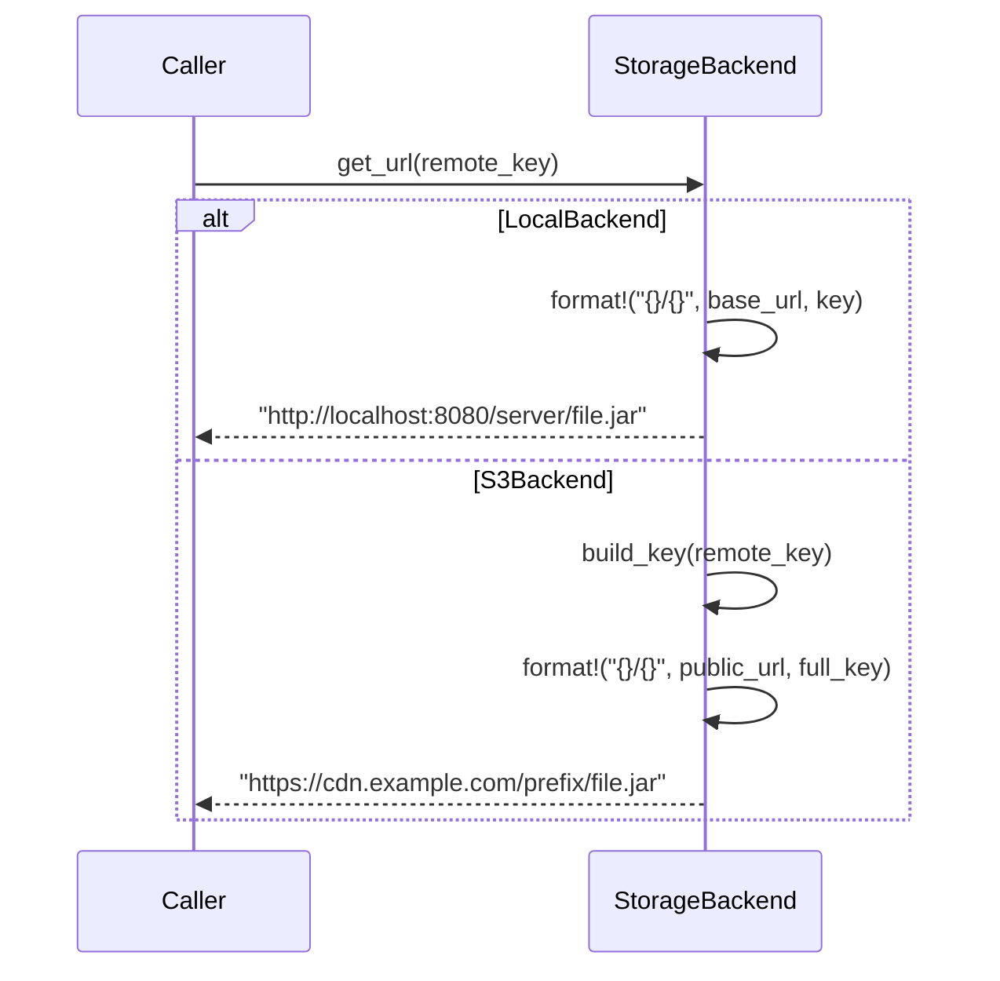
```mermaid
sequenceDiagram
    participant Caller
    participant Backend as StorageBackend

    Caller->>Backend: get_url(remote_key)

    alt LocalBackend
        Backend->>Backend: format!("{}/{}", base_url, key)
        Backend-->>Caller: "http://localhost:8080/server/file.jar"
    else S3Backend
        Backend->>Backend: build_key(remote_key)
        Backend->>Backend: format!("{}/{}", public_url, full_key)
        Backend-->>Caller: "https://cdn.example.com/prefix/file.jar"
    end
```

**Performance:** O(1) - String concatenation

## CacheManager Integration

### Cloud synchronization during rescan

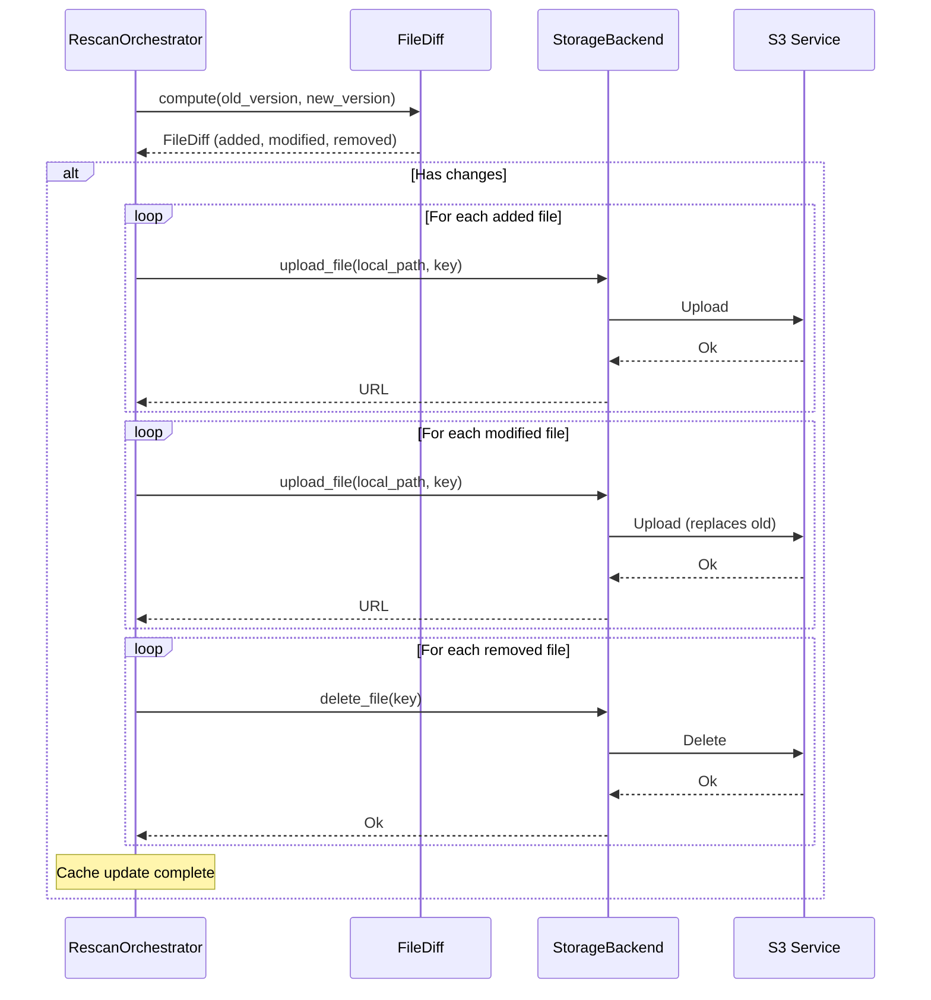
```mermaid
sequenceDiagram
    participant RO as RescanOrchestrator
    participant FD as FileDiff
    participant SB as StorageBackend
    participant S3 as S3 Service

    RO->>FD: compute(old_version, new_version)
    FD-->>RO: FileDiff (added, modified, removed)

    alt Has changes
        loop For each added file
            RO->>SB: upload_file(local_path, key)
            SB->>S3: Upload
            S3-->>SB: Ok
            SB-->>RO: URL
        end

        loop For each modified file
            RO->>SB: upload_file(local_path, key)
            SB->>S3: Upload (replaces old)
            S3-->>SB: Ok
            SB-->>RO: URL
        end

        loop For each removed file
            RO->>SB: delete_file(key)
            SB->>S3: Delete
            S3-->>SB: Ok
            SB-->>RO: Ok
        end

        Note over RO: Cache update complete
    end
```

### Upload Parallelization

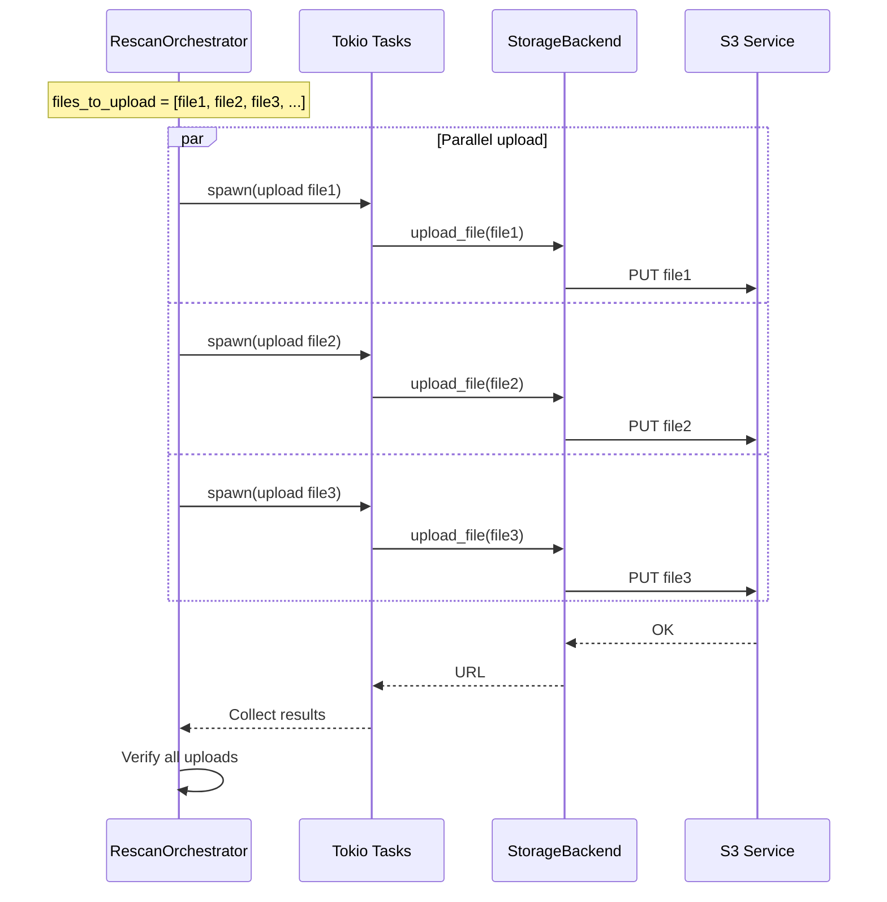
```mermaid
sequenceDiagram
    participant RO as RescanOrchestrator
    participant Tasks as Tokio Tasks
    participant SB as StorageBackend
    participant S3 as S3 Service

    Note over RO: files_to_upload = [file1, file2, file3, ...]

    par Parallel upload
        RO->>Tasks: spawn(upload file1)
        Tasks->>SB: upload_file(file1)
        SB->>S3: PUT file1
        and
        RO->>Tasks: spawn(upload file2)
        Tasks->>SB: upload_file(file2)
        SB->>S3: PUT file2
        and
        RO->>Tasks: spawn(upload file3)
        Tasks->>SB: upload_file(file3)
        SB->>S3: PUT file3
    end

    S3-->>SB: OK
    SB-->>Tasks: URL
    Tasks-->>RO: Collect results

    RO->>RO: Verify all uploads
```

## Error Handling

### Retry with exponential backoff

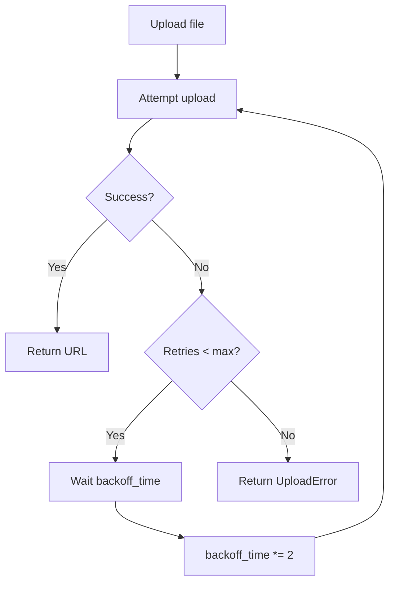
```mermaid
graph TD
    Start[Upload file] --> Attempt[Attempt upload]
    Attempt --> Success{Success?}

    Success -->|Yes| Return[Return URL]
    Success -->|No| CheckRetry{Retries < max?}

    CheckRetry -->|Yes| Wait[Wait backoff_time]
    Wait --> Increase[backoff_time *= 2]
    Increase --> Attempt

    CheckRetry -->|No| Error[Return UploadError]
```

### Local cache fallback

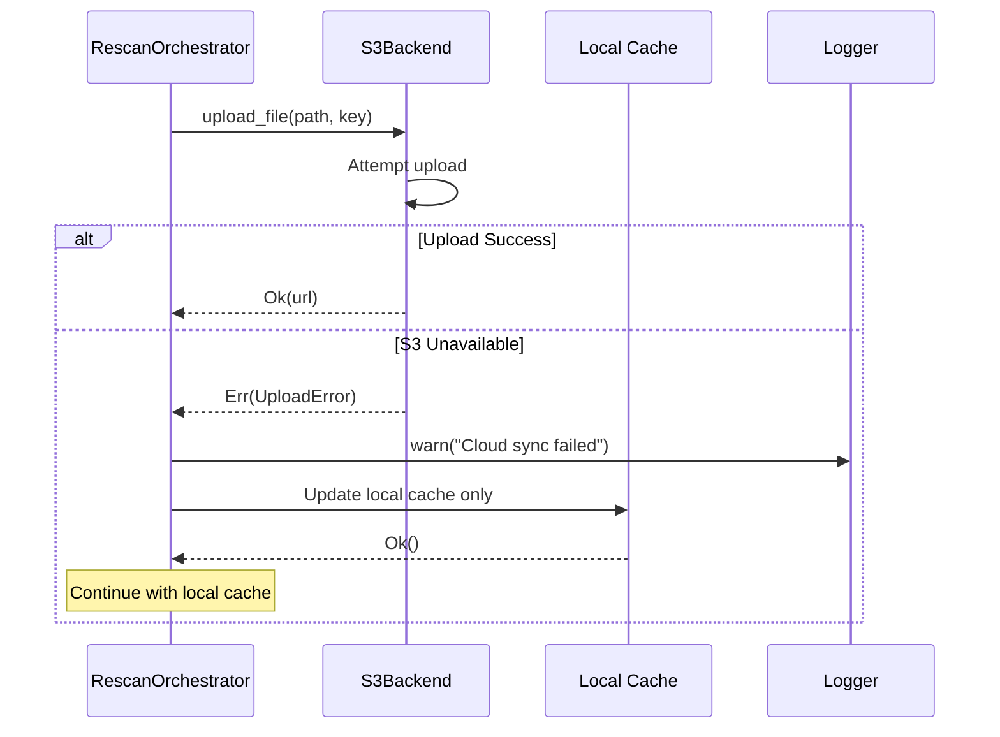
```mermaid
sequenceDiagram
    participant RO as RescanOrchestrator
    participant SB as S3Backend
    participant Cache as Local Cache
    participant Log as Logger

    RO->>SB: upload_file(path, key)
    SB->>SB: Attempt upload

    alt Upload Success
        SB-->>RO: Ok(url)
    else S3 Unavailable
        SB-->>RO: Err(UploadError)
        RO->>Log: warn("Cloud sync failed")
        RO->>Cache: Update local cache only
        Cache-->>RO: Ok()
        Note over RO: Continue with local cache
    end
```

## Performance Optimizations

### Large file streaming

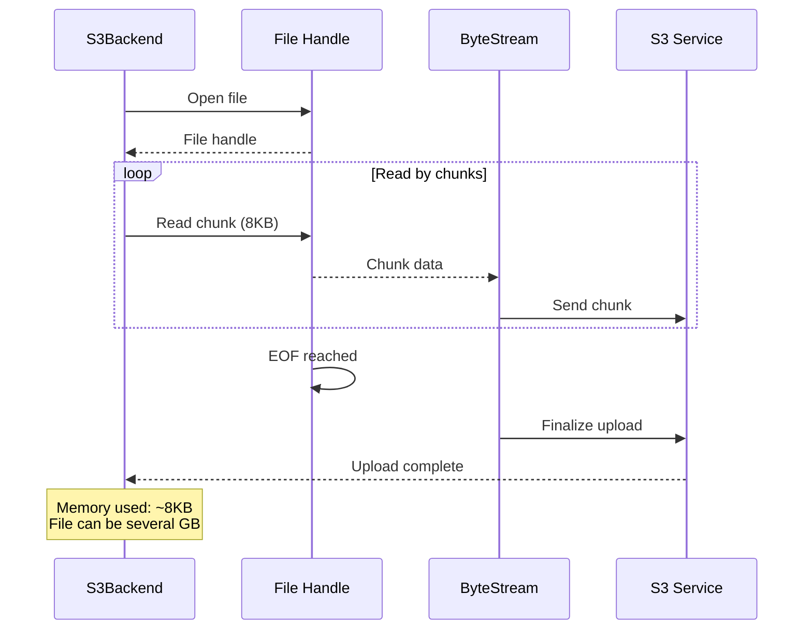
```mermaid
sequenceDiagram
    participant S3B as S3Backend
    participant File as File Handle
    participant Stream as ByteStream
    participant S3 as S3 Service

    S3B->>File: Open file
    File-->>S3B: File handle

    loop Read by chunks
        S3B->>File: Read chunk (8KB)
        File-->>Stream: Chunk data
        Stream->>S3: Send chunk
    end

    File->>File: EOF reached
    Stream->>S3: Finalize upload
    S3-->>S3B: Upload complete

    Note over S3B: Memory used: ~8KB<br/>File can be several GB
```

### Batch operations

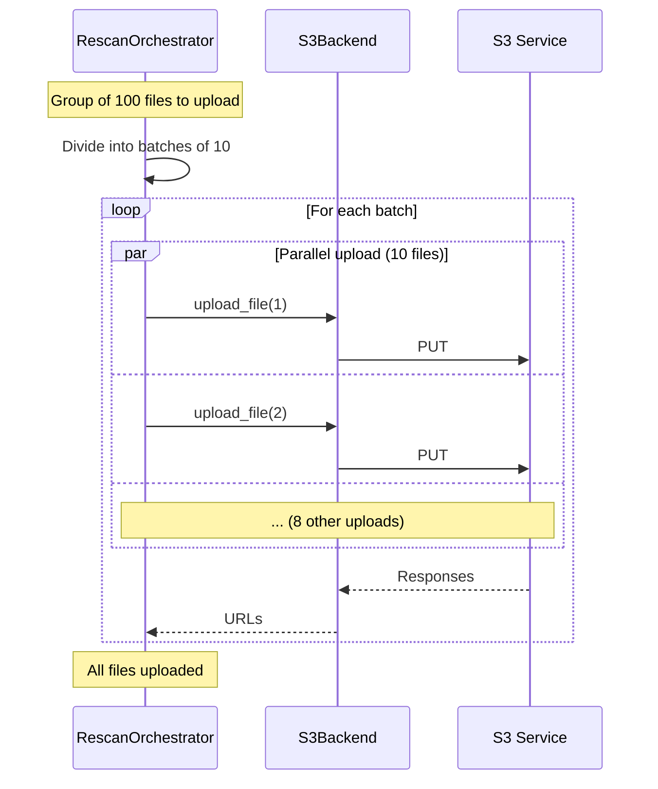
```mermaid
sequenceDiagram
    participant RO as RescanOrchestrator
    participant SB as S3Backend
    participant S3 as S3 Service

    Note over RO: Group of 100 files to upload

    RO->>RO: Divide into batches of 10
    loop For each batch
        par Parallel upload (10 files)
            RO->>SB: upload_file(1)
            SB->>S3: PUT
            and
            RO->>SB: upload_file(2)
            SB->>S3: PUT
            and
            Note over RO,S3: ... (8 other uploads)
        end
        S3-->>SB: Responses
        SB-->>RO: URLs
    end

    Note over RO: All files uploaded
```

## Metrics and Monitoring

### Collected metrics

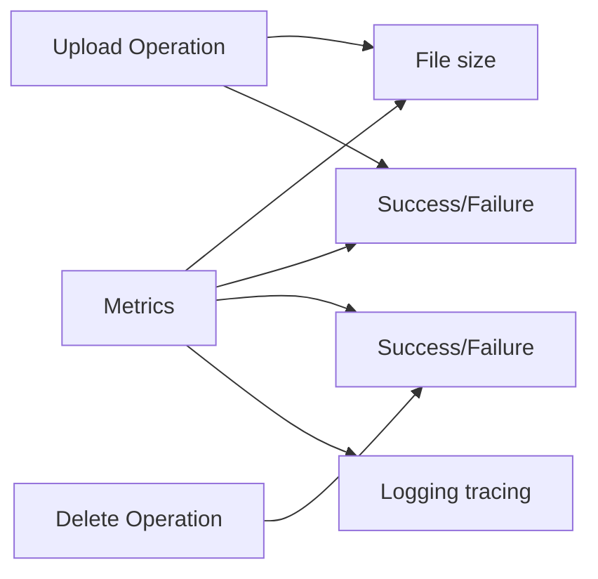
```mermaid
graph LR
    Upload[Upload Operation] --> Size[File size]
    Upload --> Success[Success/Failure]

    Delete[Delete Operation] --> DelSuccess[Success/Failure]

    Metrics[Metrics] --> Size
    Metrics --> Success
    Metrics --> DelSuccess

    Metrics --> Log[Logging tracing]
```

### Operation traces

S3 operations are traced with:
- File key
- Target bucket
- Result (success/error)
- File size (for uploads)
