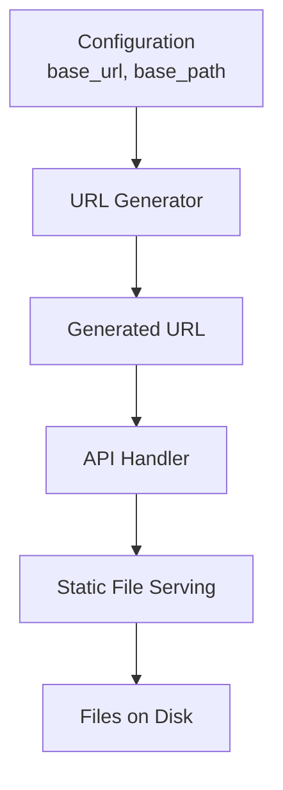
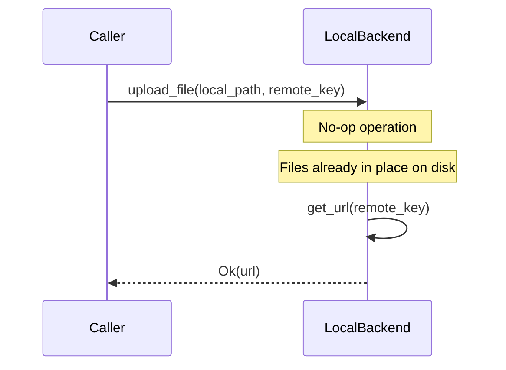
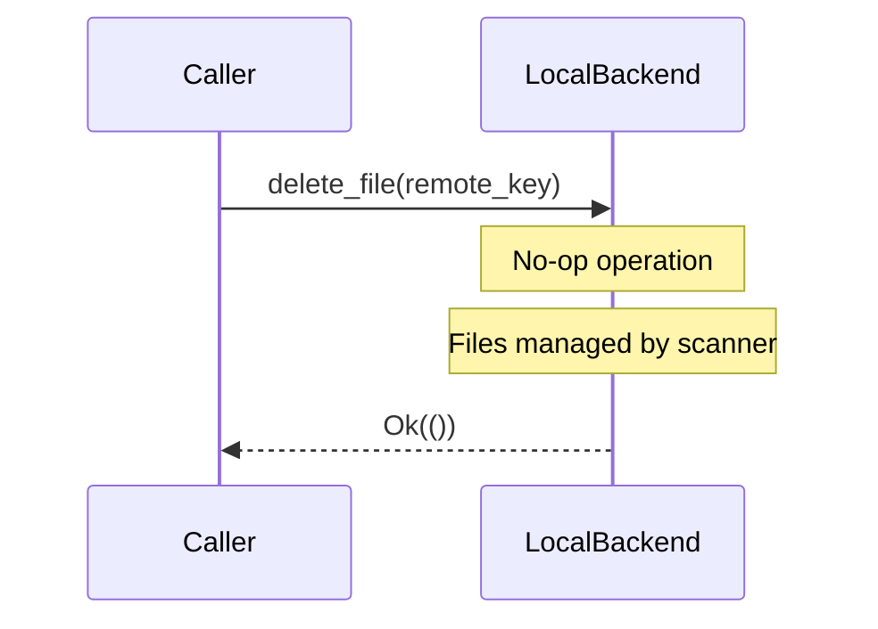
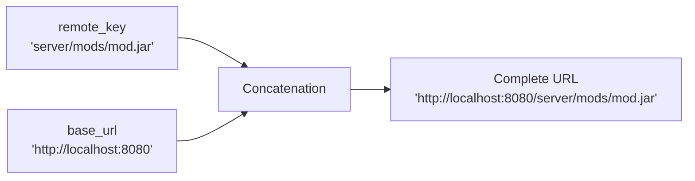
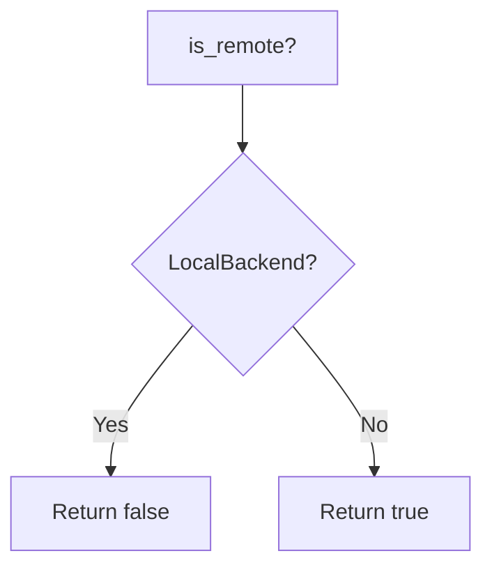
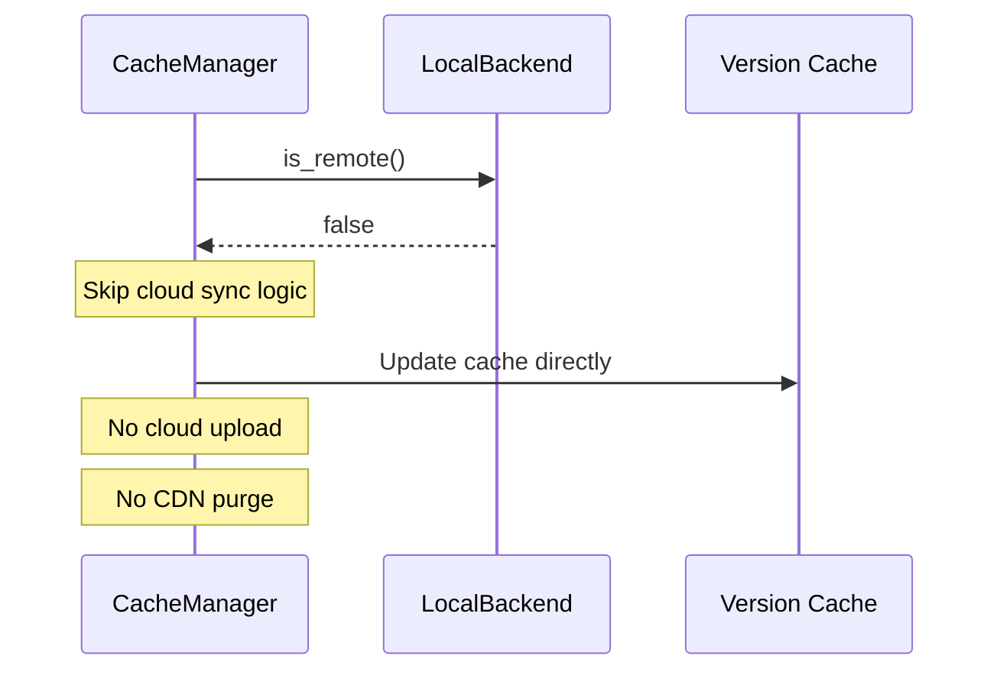
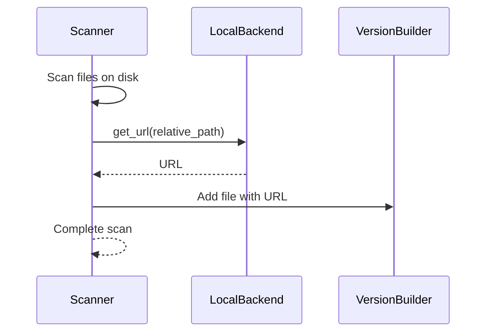

# Local Backend - LocalBackend

## Overview

The `LocalBackend` is an implementation of the `StorageBackend` trait optimized for local disk storage. It is designed for scenarios where files are served directly from the HTTP server without requiring cloud storage.

## Architecture



## Configuration

### Parameters

**base_url** (String)
- HTTP server base URL
- Used to generate public URLs
- Format: `http://domain:port` or `https://domain`

**base_path** (PathBuf)
- Root path where files are stored
- Stored but not actively used by the backend
- Used by calling components to build paths

## Operations

### File Upload



**Features:**
- Instant operation (no I/O)
- No file copying
- No existence verification
- Simply returns generated URL

**Rationale:**
In local mode, files are already scanned and present on disk. The scanner and cache manage files directly. The backend only generates URLs.

### File Deletion



**Features:**
- Instant operation (no I/O)
- No physical deletion
- Always returns success
- Idempotent by nature

**Rationale:**
The scanner and cache manage file lifecycle. When a file is deleted from the server, rescan automatically detects its absence and updates the cache.

### URL Generation



**Implementation:**

URL generation is a simple concatenation:
- Format: `{base_url}/{remote_key}`
- No validation
- No escaping (handled by caller)
- O(1) performance

### Backend Type Verification



**Usage:**
- Allows cache to know if real uploads are necessary
- Optimizes synchronization decisions
- Enables/disables certain features

## Use Cases

### Local Development

**Scenario:**
A developer working on LightyUpdater locally.

**Configuration:**

```toml
[storage]
type = "local"
base_url = "http://localhost:8080"
base_path = "./servers"
```

**Advantages:**
- No cloud credentials needed
- Instant startup
- Easier debugging
- No storage costs

### Monolithic Deployment

**Scenario:**
Single server serving files directly.

**Configuration:**

```toml
[storage]
type = "local"
base_url = "https://files.example.com"
base_path = "/var/minecraft/servers"
```

**Advantages:**
- Simple architecture
- No external dependencies
- Fast operations
- Total control

### Automated Tests

**Scenario:**
Cache system integration tests.

**Advantages:**
- No mocking needed
- Fast tests
- No network flakiness
- Perfect reproducibility

## Performance

### Optimizations

**Zero-copy:**
- No data copying
- No memory allocation for operations
- Only string operations

**No I/O:**
- No disk access
- No system calls
- User space execution only

**Predictable:**
- Constant O(1) complexity
- No network variance
- Deterministic performance

## Limitations

### No Existence Verification

The backend doesn't verify if files actually exist:
- Can generate URLs to non-existent files
- Scanner's responsibility to maintain coherence
- 404s handled by HTTP server

### No Validation

No parameter validation:
- `remote_key` can contain invalid characters
- No path traversal protection (handled by API)
- Generated URLs can be malformed if input invalid

### Horizontal Scaling

Local backend doesn't natively support:
- Multi-server distribution
- File load balancing
- CDN integration
- Geo-replication

For these cases, use S3Backend with a CDN frontend.

## Comparison with S3Backend

| Aspect | LocalBackend | S3Backend |
|--------|-------------|-----------|
| Upload operation | No-op (instant) | Network upload required |
| Delete operation | No-op (instant) | HTTP request required |
| Bandwidth | None | Upload to cloud |
| Complexity | Minimal | AWS SDK, credentials |
| Scaling | Vertical | Horizontal |
| Cost | Free | Pay-as-you-go |
| Resilience | Single disk | Multi-AZ, redundancy |
| CDN | Needed separately | Integrated (CloudFront, etc) |

## Integration

### With CacheManager



### With Scanner



## Migration to S3Backend

To migrate from Local to S3:

1. Configure S3Backend in config
2. Existing files remain on local disk
3. On next rescan, all files are uploaded to S3
4. Update `base_url` to point to CDN
5. Old local files can be deleted

Migration is transparent thanks to trait abstraction.
