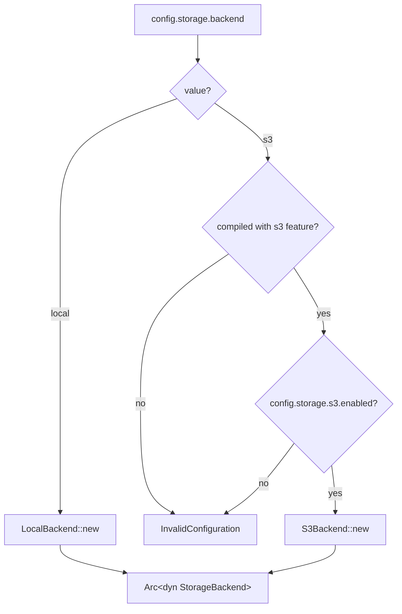

# Overview

`lighty-storage` defines the storage backend abstraction the rest of
the workspace targets. Two concrete implementations ship today:

- `LocalBackend` — files served straight from a directory tree under
  `server.base_path`.
- `S3Backend` (feature `s3`) — uploads and serves through any
  S3-compatible bucket. Tested against Cloudflare R2.

Anything that wants to read or write a server file goes through the
`StorageBackend` trait — never `std::fs` directly. That means the
rescan loop, the file cache bulk-load and the api fall back path all
work transparently against local disk or remote storage.

## What's inside

| Item | Purpose |
|---|---|
| `StorageBackend` trait | `upload_file`, `delete_file`, `read_bytes`, `url`, `is_remote`, etc. |
| `LocalBackend` | Reads/writes through `tokio::fs`; `url` returns `{base_url}/{key}`. |
| `S3Backend` (feature `s3`) | Built on `aws-sdk-s3`; supports a `bucket_prefix` for multi-tenant clusters. |
| `StorageError` | One error type; `#[from]` for `io`, `aws-sdk-s3` errors. |

## Selection at boot

`lighty-runtime::initialize_storage` is the only place that
constructs a backend. Everywhere else takes `Arc<dyn StorageBackend>`.

## Design notes

- **`is_remote` drives the cloud-sync branch.** `lighty-rescan` calls
  it before deciding to upload/delete after a diff. `LocalBackend`
  returns `false`; `S3Backend` returns `true`.
- **`url(key)` is the source of truth for public URLs.** Per-file
  URLs in `VersionBuilder` come from here; no other crate
  reconstructs them.
- **Feature-gating is conservative.** AWS SDK has heavy native deps
  (compresses to ~30 MB of code). Keeping it off by default makes a
  local-only build small and CI fast.

## Cargo features

| Feature | Effect |
|---|---|
| `s3` | Pulls `aws-sdk-s3`, `aws-config`, `aws-credential-types` and exposes `S3Backend`. |

## See also

- [`how-to-use.md`](./how-to-use.md) — backend selection + manual use
- [`exports.md`](./exports.md) — full public surface
- [`local.md`](./local.md), [`s3.md`](./s3.md) — per-backend details
- [`flow.md`](./flow.md), [`architecture.md`](./architecture.md) —
  internals
- [`../../rescan/docs/flows.md`](../../rescan/docs/flows.md) — the
  primary writer (cloud sync after a diff)
