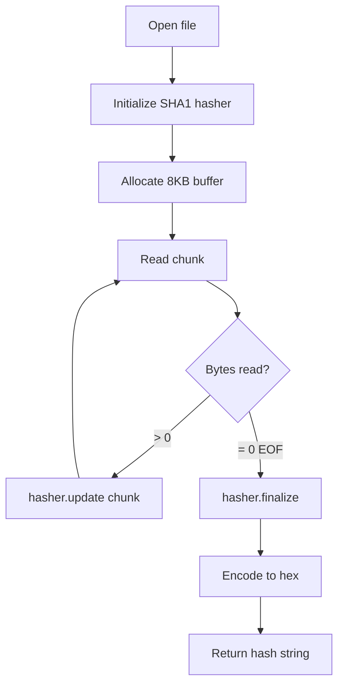

# SHA1 Checksum Calculation

## Streaming Algorithm



## Asynchronous Versions

**compute_sha1**: Hash only
```rust
let hash = compute_sha1("/path/to/file.jar").await?;
// "abc123def456..."
```

**compute_sha1_with_size**: Hash + size
```rust
let (hash, size) = compute_sha1_with_size("/path/to/file.jar", 8192).await?;
// ("abc123...", 1024000)
```

## Synchronous Versions

**compute_sha1_sync**: Blocking
```rust
let hash = compute_sha1_sync("/path/to/file.jar")?;
```

## Buffer Configuration

Default buffer size: 8KB
- Small file (< 1MB): Minimal impact
- Large file (> 100MB): Larger buffer = faster
- Recommendation: 8KB-64KB depending on use case

## Performance

**100MB file, 8KB buffer**:
- Async: ~800ms
- Sync: ~850ms
- Streaming memory: ~8KB constant

**100MB file, 64KB buffer**:
- Async: ~600ms
- Faster but 8x more memory
