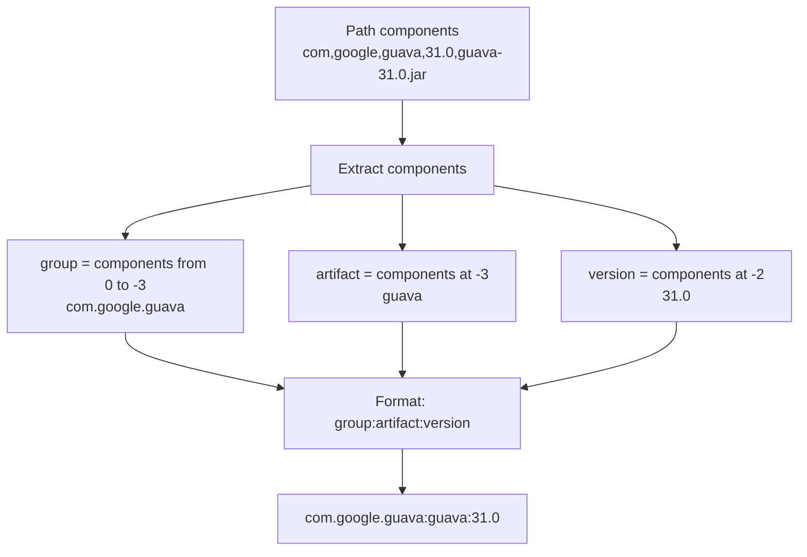

# Path Utilities

## path_to_maven_name

Converts a library path to Maven notation.

**Maven Format**: `group:artifact:version`

**Algorithm**:


**Example**:
```rust
let path = Path::new("com/google/guava/31.0/guava-31.0.jar");
let maven = path_to_maven_name(path);
// "com.google.guava:guava:31.0"
```

## normalize_path

Normalizes separators for cross-platform compatibility.

**Transformation**: `\` to `/`

**Examples**:
```rust
// Windows path
normalize_path(Path::new("mods\\JEI-1.20.1.jar"))
// "mods/JEI-1.20.1.jar"

// Unix path (unchanged)
normalize_path(Path::new("mods/JEI-1.20.1.jar"))
// "mods/JEI-1.20.1.jar"
```

**Rationale**: URLs always use `/`, normalization necessary on Windows.
