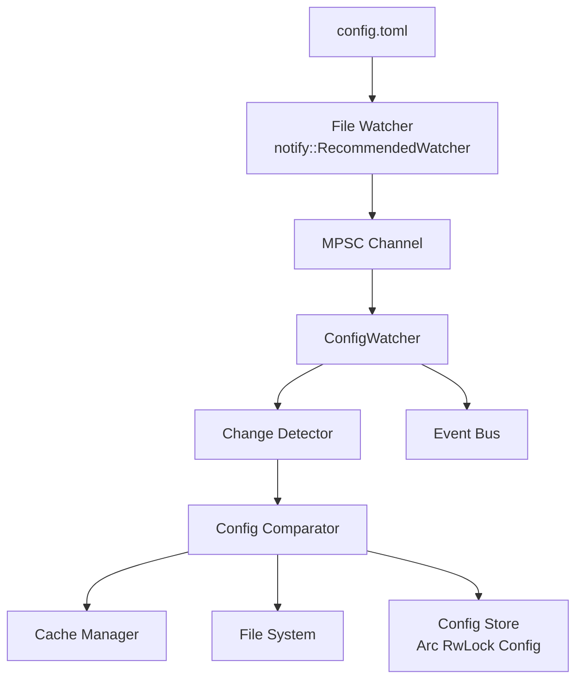
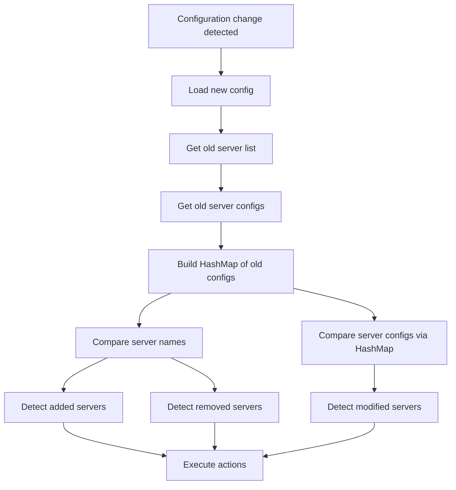
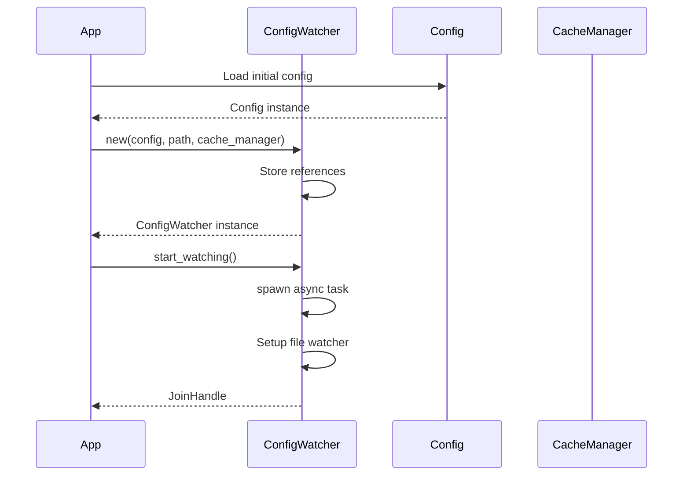
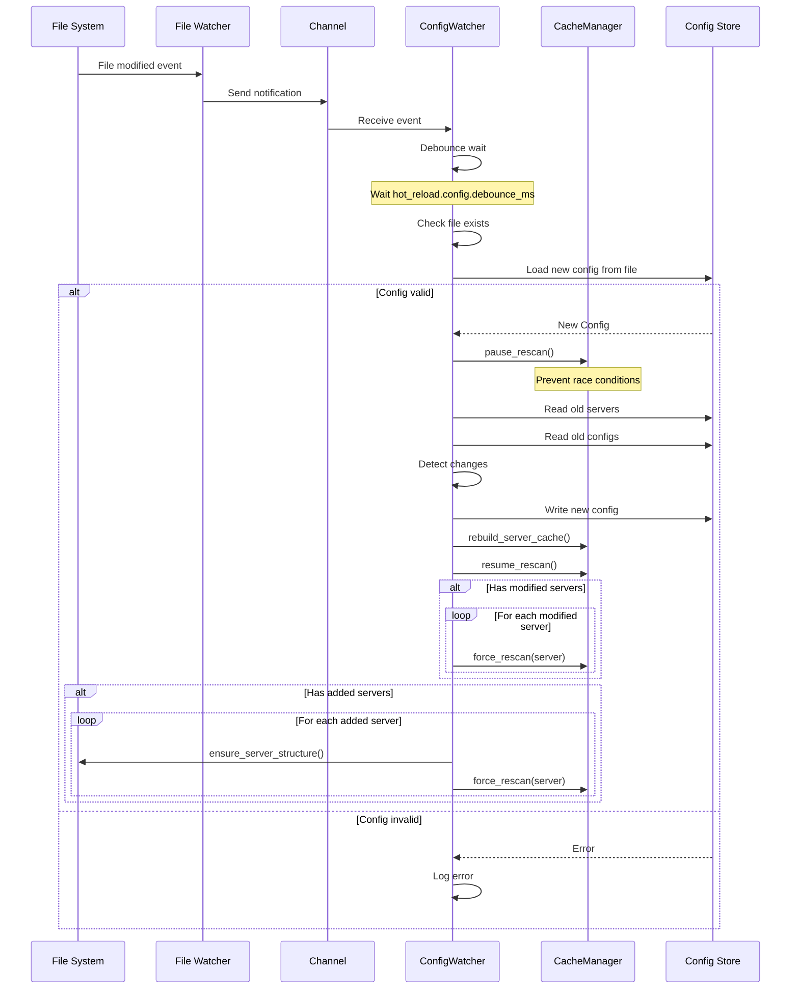
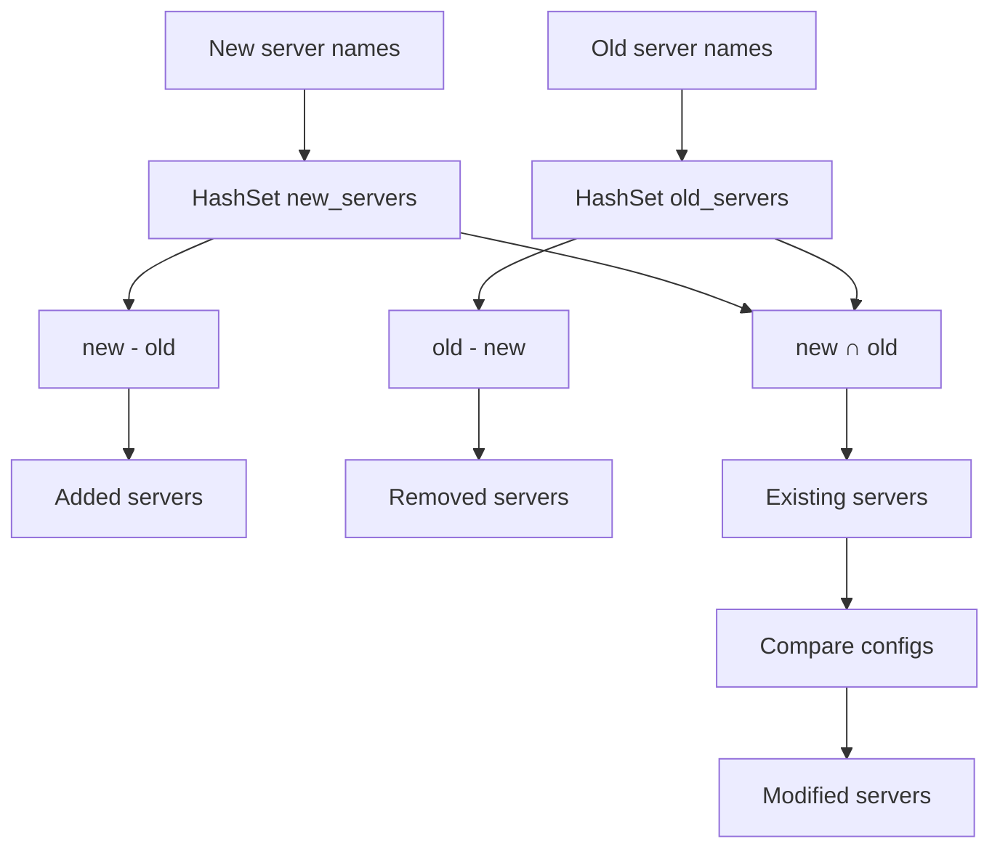
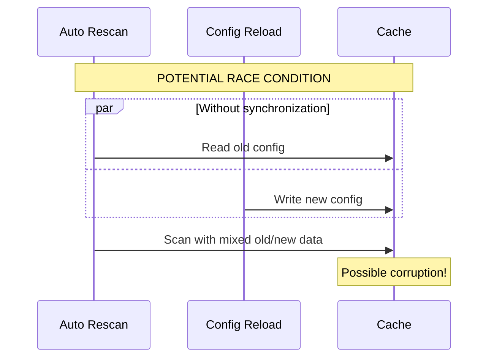
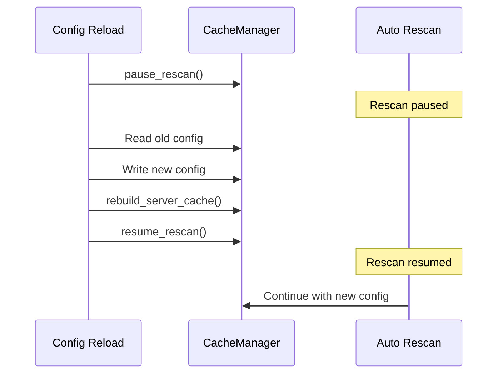
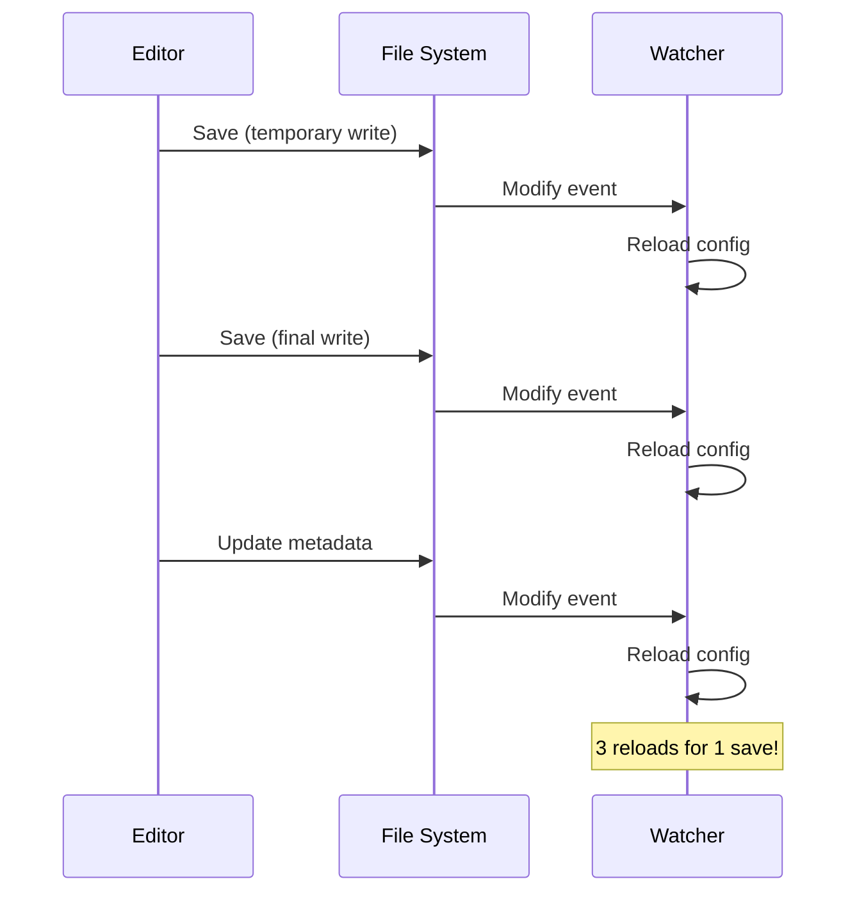
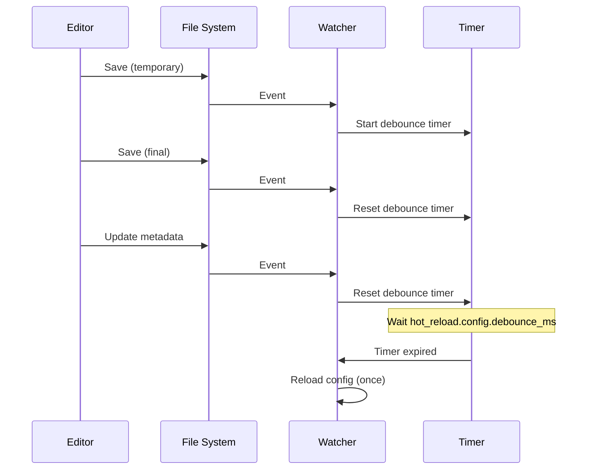
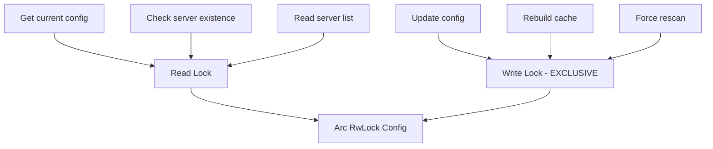

# Configuration Monitoring System Architecture

## Overview

The monitoring system is designed to detect and react to configuration file changes in real-time, with a robust race condition prevention mechanism.

## Diagramme d'architecture



## Main Components

### ConfigWatcher

Central structure managing configuration file monitoring.

**Data:**
- `config`: Arc<RwLock<Config>> - Shared read/write configuration
- `config_path`: String - Path to configuration file to monitor
- `cache_manager`: Arc<CacheManager> - Reference to cache manager

**Responsibilities:**
- Initialize file watcher with notify
- Handle communication channel for events
- Debounce multiple changes
- Coordinate configuration updates
- Trigger necessary rescans

### File Watcher (notify)

System component monitoring file modifications.

**Type:** `notify::RecommendedWatcher`
- Uses inotify on Linux
- Uses FSEvents on macOS
- Uses ReadDirectoryChangesW on Windows

**Captured events:**
- `EventKind::Modify`: File modified
- `EventKind::Create`: File created

**Mode:** `RecursiveMode::NonRecursive`
- Monitors only the specific file
- No recursive folder monitoring

### MPSC Channel

Asynchronous channel for communication between watcher and handler.

**Configuration:**
- Configurable capacity via `config.cache.config_reload_channel_size`
- Default: 10 events
- Type: `tokio::sync::mpsc::channel`

**Flow:**
- Producer: File watcher callback
- Consumer: ConfigWatcher main loop

### Change Detector

Configuration change detection logic.

**Comparisons:**
- Added servers detection
- Modified servers detection
- Removed servers detection

**Algorithm:**



**Performance:**
Server config comparison uses a HashMap for fast lookups when checking modifications.

## Data Flow

### Initialization



### Change Detection and Processing



## Configuration Change Detection

### Server Comparison



### Monitored Fields for Modifications

The system checks the following fields to detect significant modifications:

**Server configuration fields:**
- `enabled`: Server activation/deactivation
- `loader`: Loader type (Forge, Fabric, etc.)
- `loader_version`: Loader version
- `minecraft_version`: Minecraft version
- `main_class`: Java main class
- `java_version`: Required Java version
- `enable_client`: Client JAR activation
- `enable_libraries`: Libraries activation
- `enable_mods`: Mods activation
- `enable_natives`: Natives activation
- `enable_assets`: Assets activation
- `game_args`: Game arguments
- `jvm_args`: JVM arguments

**Comparison algorithm:**

```rust
fn server_config_changed(old: &ServerConfig, new: &ServerConfig) -> bool {
    old.enabled != new.enabled
        || old.loader != new.loader
        || old.loader_version != new.loader_version
        || old.minecraft_version != new.minecraft_version
        // ... other fields
}
```

## Race Condition Prevention

### Problem



### Solution: Pause/Resume



**Mechanism:**
- CacheManager uses an atomic flag to pause/resume
- Automatic rescans check this flag before executing
- Config reload is protected by an exclusive write lock
- Guaranteed sequence: pause → update → resume

## Debouncing

### Problem Without Debouncing



### Solution With Debouncing



**Configuration:**
- Configurable delay via `config.hot_reload.config.debounce_ms`
- Default: 300ms
- Enable/disable via `config.hot_reload.config.enabled`
- Each event resets the timer
- Reload only executes after delay with no new events

## Concurrency Management

### Used Locks



**Strategy:**
- Multiple simultaneous reads possible
- Exclusive write blocks all reads
- Lock released between I/O operations to avoid deadlocks
- Pattern: acquire → read/write → drop → I/O → re-acquire

### Lock Release Pattern

```rust
// Acquire lock
let mut config_write = config.write().await;

// Config operations
*config_write = new_config;
cache_manager.rebuild_server_cache().await;

// Explicit release before I/O
drop(config_write);

// I/O operations without lock
FileSystem::ensure_server_structure(&path, &folder).await;
cache_manager.force_rescan(&server).await;

// Re-acquire if necessary
config_write = config.write().await;
```

## Optimizations

### Channel Sizing

Channel size based on:
- Config file modification frequency
- Processing time per event
- Available memory

**Recommendations:**
- Development: 10 (default)
- Stable production: 5
- Frequent hot-reload: 20

### HashSet for Comparison

Using HashSet for efficient comparisons:
- Converting server lists to HashSet
- Fast difference and intersection operations
- Efficient server list comparisons

### Lazy Evaluation

Expensive operations only execute when necessary:
- No rescan if no server modified
- No folder creation if server disabled
- File validation before full reload

## Extensibility

### Adding New Change Types

To monitor other aspects of the configuration:

1. Add fields in `server_config_changed`
2. Implement comparison logic
3. Trigger appropriate actions
4. Document the behavior

### Multiple File Support

The system can be extended to monitor multiple files:
- One watcher per file
- Change aggregation
- Centralized coordination
