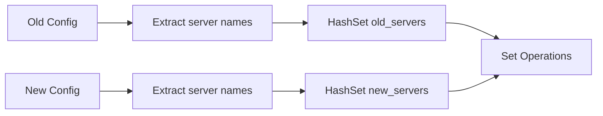
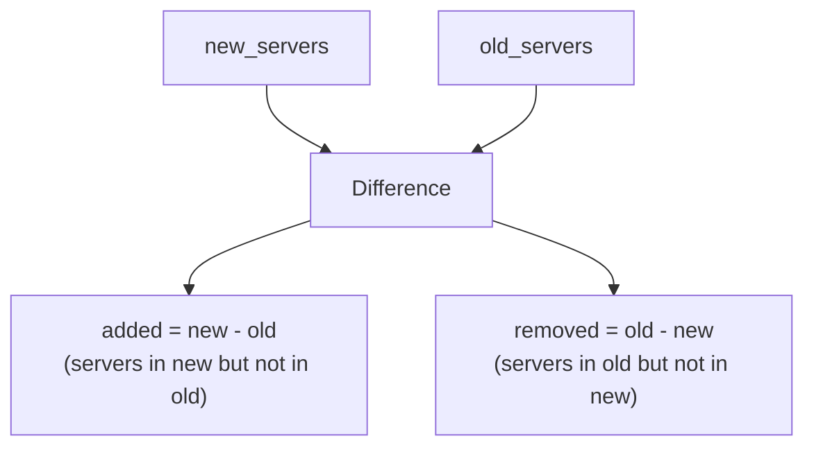
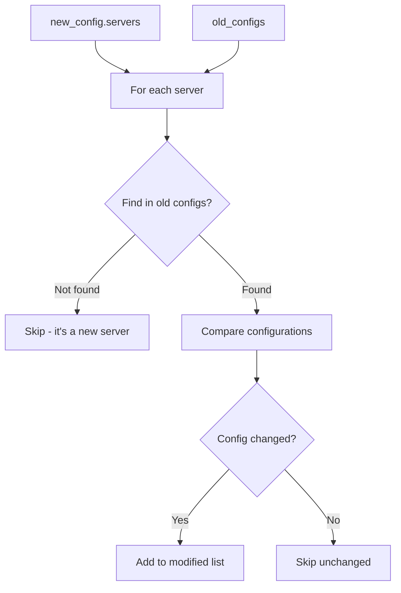
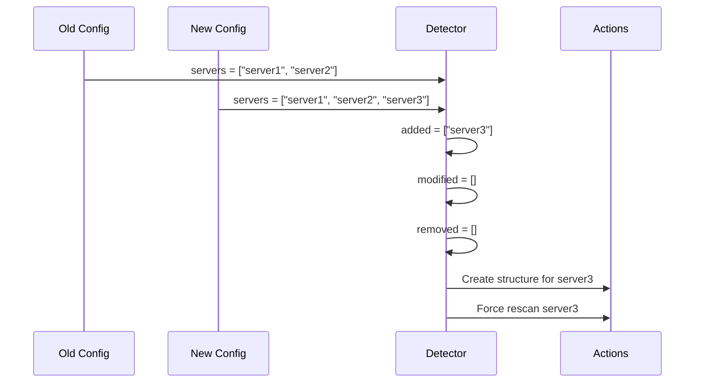
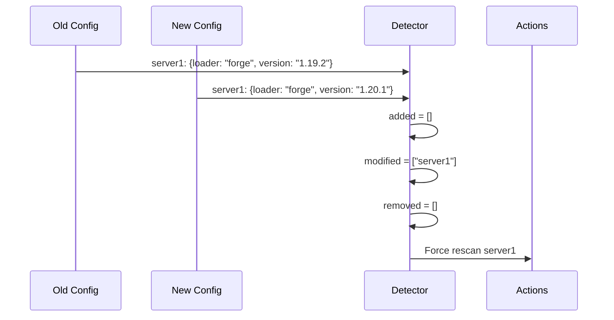
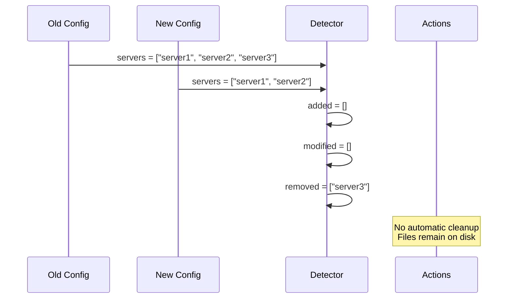
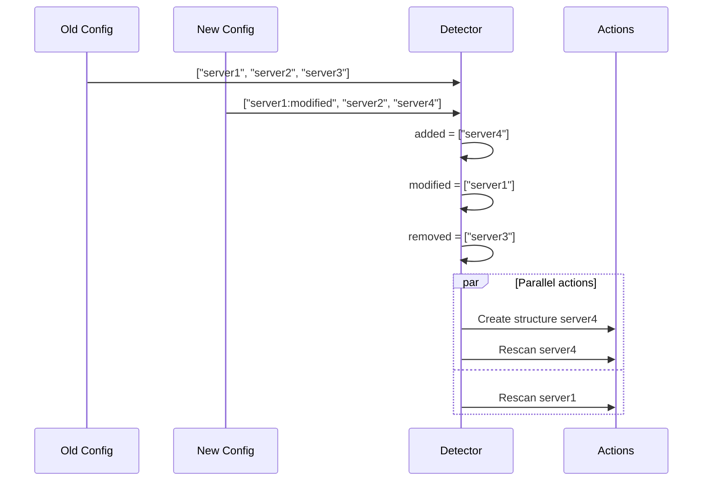
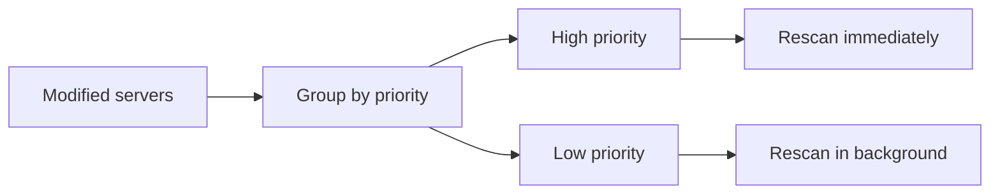
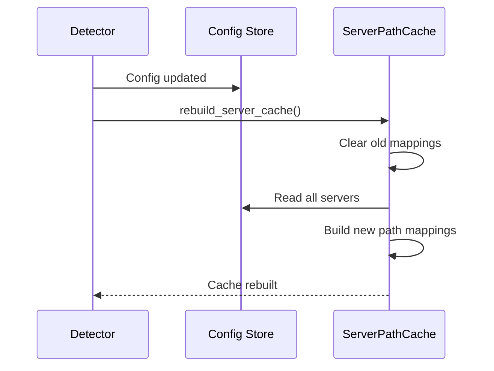
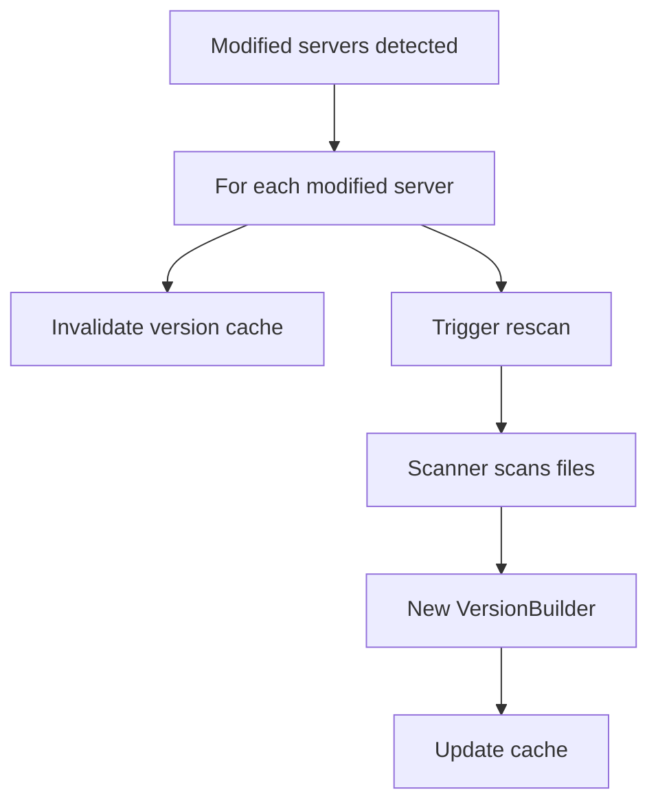

# Configuration Change Detection

## Overview

The detection system precisely identifies which servers have been added, modified, or removed during a configuration reload.

## Detection Algorithm

### Step 1: Building Sets



### Step 2: Added/Removed Servers Detection



### Step 3: Modified Servers Detection



## Monitored Fields

### Critical Fields Triggering Rescan

Changes to these fields require a complete server rescan:

**Server identity:**
- `loader`: Change from Forge to Fabric, etc.
- `loader_version`: New loader version
- `minecraft_version`: Minecraft version change

**Java configuration:**
- `main_class`: Different main class
- `java_version`: Modified required Java version

**Component activation:**
- `enable_client`: Activate/deactivate client JAR
- `enable_libraries`: Activate/deactivate libraries
- `enable_mods`: Activate/deactivate mods
- `enable_natives`: Activate/deactivate natives
- `enable_assets`: Activate/deactivate assets

**Arguments:**
- `game_args`: Modified game arguments
- `jvm_args`: Modified JVM arguments

**Status:**
- `enabled`: Server activation/deactivation

### Comparison Implementation

```rust
fn server_config_changed(old: &ServerConfig, new: &ServerConfig) -> bool {
    old.enabled != new.enabled
        || old.loader != new.loader
        || old.loader_version != new.loader_version
        || old.minecraft_version != new.minecraft_version
        || old.main_class != new.main_class
        || old.java_version != new.java_version
        || old.enable_client != new.enable_client
        || old.enable_libraries != new.enable_libraries
        || old.enable_mods != new.enable_mods
        || old.enable_natives != new.enable_natives
        || old.enable_assets != new.enable_assets
        || old.game_args != new.game_args
        || old.jvm_args != new.jvm_args
}
```

## Change Scenarios

### Scenario 1: Adding a New Server



### Scenario 2: Modifying an Existing Server



### Scenario 3: Removing a Server



### Scenario 4: Multiple Changes



## Optimizations

### Using HashSet

**Advantages:**
- O(1) lookups instead of O(n)
- Efficient set operations
- Fast comparisons

### Lazy Comparison

Configuration comparison is only done for servers existing in both configs:

```rust
// New server: no comparison necessary
if !old_servers.contains(&server.name) {
    continue;
}

// Existing server: comparison necessary
if let Some(old_server) = old_configs.iter().find(|s| s.name == server.name) {
    if server_config_changed(old_server, &server) {
        modified_servers.push(server.name.clone());
    }
}
```

### Rescan Batching

Rescans can be batched to optimize performance:



## Special Cases

### Disabled to Active Server

```rust
old.enabled = false
new.enabled = true
// Result: modified = true, rescan triggered
```

Action: Complete rescan like for a new server.

### Active to Disabled Server

```rust
old.enabled = true
new.enabled = false
// Result: modified = true, but rescan skipped
```

Action: No rescan, server is simply ignored.

### Name Change Only

```rust
old: name = "server1"
new: name = "server1_renamed"
// Result: removed = ["server1"], added = ["server1_renamed"]
```

Action: Treated as removal + addition. server1 cache is lost.

### Simultaneous Multiple Modifications

If multiple fields change simultaneously, only one rescan is triggered:

```rust
// Multiple changes
old.loader != new.loader
old.minecraft_version != new.minecraft_version
old.enable_mods != new.enable_mods

// Result: single rescan, not three
```

## Cache Integration

### ServerPathCache Update



### Version Cache Invalidation



## Logging and Observability

### Generated Logs

```rust
// New server
tracing::info!("New server detected: {}", server_name);

// Modified server
tracing::info!("Server config changed, rescanning: {}", server_name);

// Removed server
// No log (silent removal)
```

### Collected Metrics

- Number of servers added per reload
- Number of servers modified per reload
- Number of servers removed per reload
- Change detection time
- False positive rate (change detected but identical)
