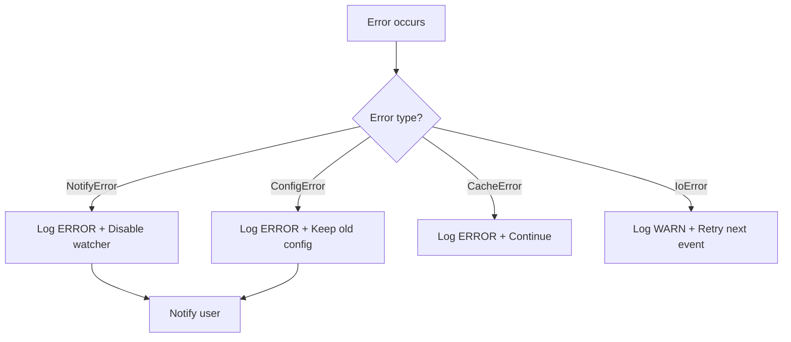
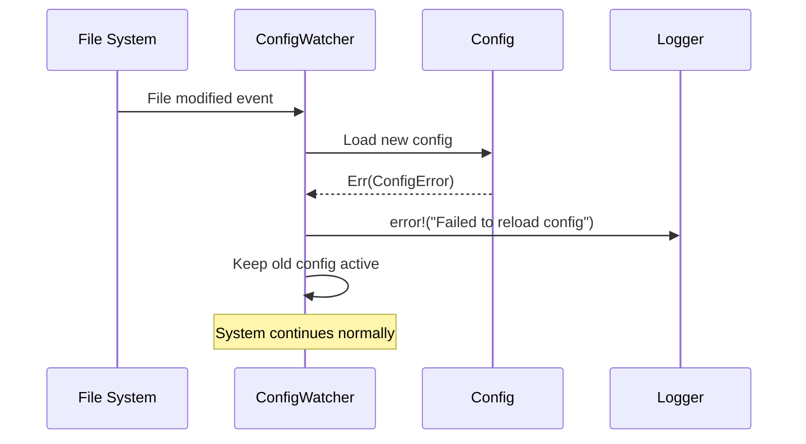
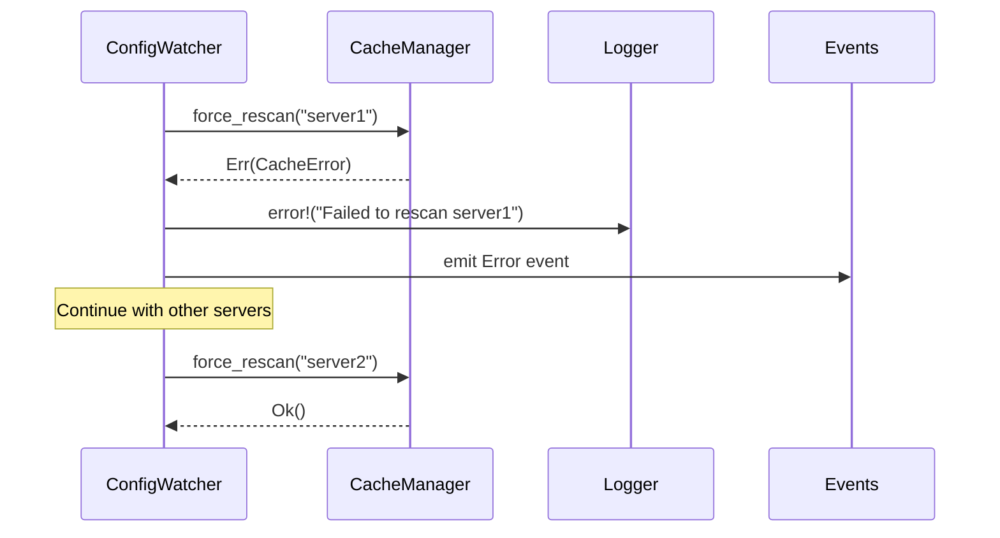

# Error Documentation

This document describes the different error types handled by the `watcher` crate.

## Main Type: WatcherError

The `WatcherError` type is an enumeration that groups all possible errors from the configuration monitoring system.

## Error Types

### IoError

```rust
#[error("I/O error: {0}")]
IoError(#[from] std::io::Error)
```

**Description**: Input/output error when reading the configuration file.

**Possible causes**:
- Inaccessible configuration file
- Insufficient permissions
- File deleted during reading
- Disk error

**Context of occurrence**:
- Checking config file existence
- File reading by notify
- Pre-reload validation operations

**Handling**: Error is logged with a warning. Reload is ignored and system continues with the old configuration.

---

### ConfigError

```rust
#[error("Config error: {0}")]
ConfigError(#[from] lighty_config::ConfigError)
```

**Description**: Error during parsing or validation of the new configuration.

**Possible causes**:
- Invalid TOML syntax
- Missing or incorrect fields
- Values out of bounds
- Invalid configuration structure

**Context of occurrence**:
- Loading new configuration via `Config::from_file_with_events`
- Server parameter validation
- Configuration schema migration

**Handling**: Error is logged with ERROR. New configuration is rejected and old one remains active.

---

### CacheError

```rust
#[error("Cache error: {0}")]
CacheError(#[from] lighty_cache::CacheError)
```

**Description**: Error from CacheManager during rescan operations.

**Possible causes**:
- Server rescan failure
- Error during server path cache rebuild
- Cloud synchronization problem
- Cache corruption

**Context of occurrence**:
- `force_rescan` for modified or added servers
- `rebuild_server_cache` after configuration update
- Synchronization operations

**Handling**: Error is logged. Affected server is marked as error but other servers continue to function.

---

### NotifyError

```rust
#[error("Notify error: {0}")]
NotifyError(#[from] notify::Error)
```

**Description**: Error from the notify library during file monitoring.

**Possible causes**:
- Unsupported file system
- Too many watched files (OS limit)
- Invalid path
- Insufficient permissions for inotify (Linux)

**Context of occurrence**:
- File watcher initialization
- Adding a path to watch
- Watcher configuration change

**Handling**: Fatal error for the watcher. System continues to function but without automatic configuration reload.

---

### FileSystemError

```rust
#[error("File system error: {0}")]
FileSystemError(String)
```

**Description**: Error during file system operations.

**Possible causes**:
- Folder creation failure for new server
- Invalid or too long path
- Disk full
- Insufficient permissions

**Context of occurrence**:
- Folder structure creation for added servers
- File existence verification
- Cleanup operations

**Handling**: Error is logged. Affected server may not function correctly but others continue.

---

### WatchFailed

```rust
#[error("Watch operation failed: {0}")]
WatchFailed(String)
```

**Description**: Monitoring operation failure.

**Possible causes**:
- Cannot start watcher
- Communication channel saturated
- Monitoring task crashed
- Insufficient system resources

**Context of occurrence**:
- Starting monitoring via `start_watching`
- Running monitoring loop
- Processing file events

**Handling**: Serious error indicating monitoring is not working. System continues but without automatic reload.

---

## Error Handling Strategy

### Resilience Principle

The watcher is designed to be resilient:
- Invalid configuration errors preserve the previous state
- Rescan errors don't prevent config reload
- Folder creation errors don't impact existing servers

### Severity Levels

**CRITICAL**: Errors preventing monitoring
- NotifyError during initialization
- WatchFailed at startup

**ERROR**: Errors on important operations
- ConfigError during reload
- CacheError during rescan
- FileSystemError during structure creation

**WARN**: Errors on recoverable operations
- IoError temporarily inaccessible file
- Individual server failure

### Error Propagation



### Recovery Strategies

**Config reload failure**:
- Keep old configuration active
- Log error with details
- Wait for next modification event
- Allow manual file correction

**Rescan failure**:
- Log error with server name
- Continue with other servers
- Emit error event
- Allow manual retry via API

**Watcher crash**:
- Log fatal error
- Disable automatic watcher
- System continues to function
- Manual reload possible via signal

## Error Flow Examples

### Invalid Configuration



### Rescan Failure



## Logging and Monitoring

Each error type generates structured logs:

```rust
// ConfigError
tracing::error!(
    path = %config_path,
    error = %err,
    "Failed to reload config"
);

// CacheError
tracing::error!(
    server = %server_name,
    error = %err,
    "Failed to rescan modified server"
);

// NotifyError
tracing::error!(
    error = %err,
    "Config watcher error"
);
```
