# Monitoring System Processing Flow

## Overview

This document details the execution flows for each operation of the configuration monitoring system.

## Starting Monitoring

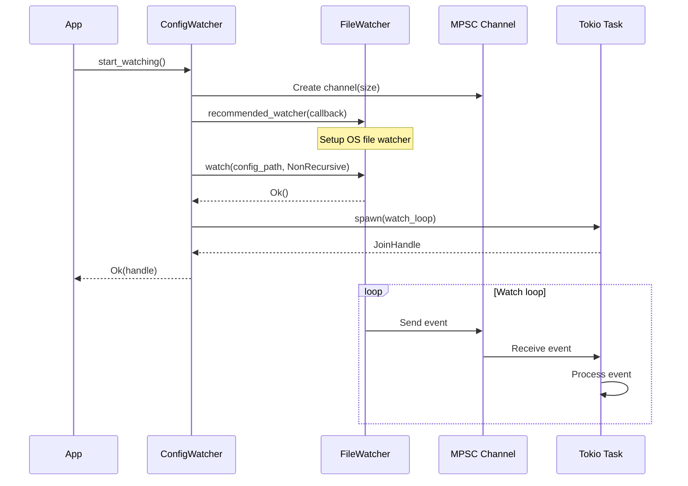

## File Modification Detection

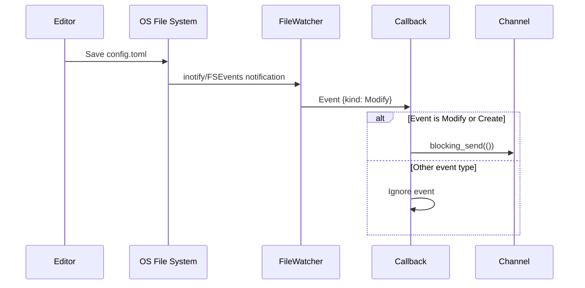

## Event Processing with Debouncing

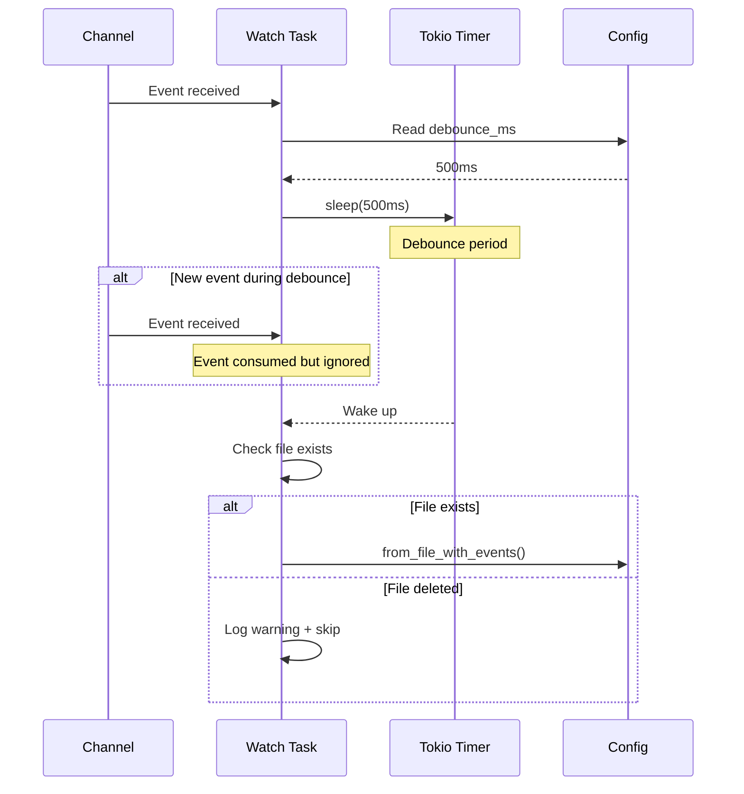

## Configuration Comparison

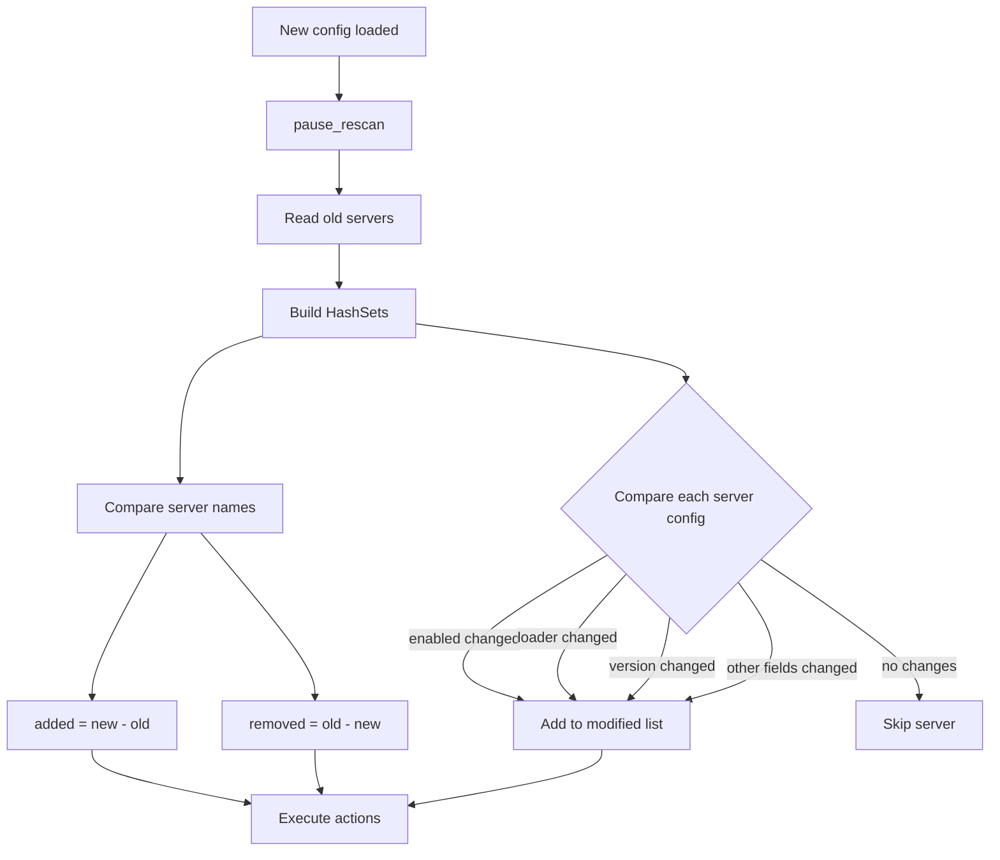

## Configuration Update

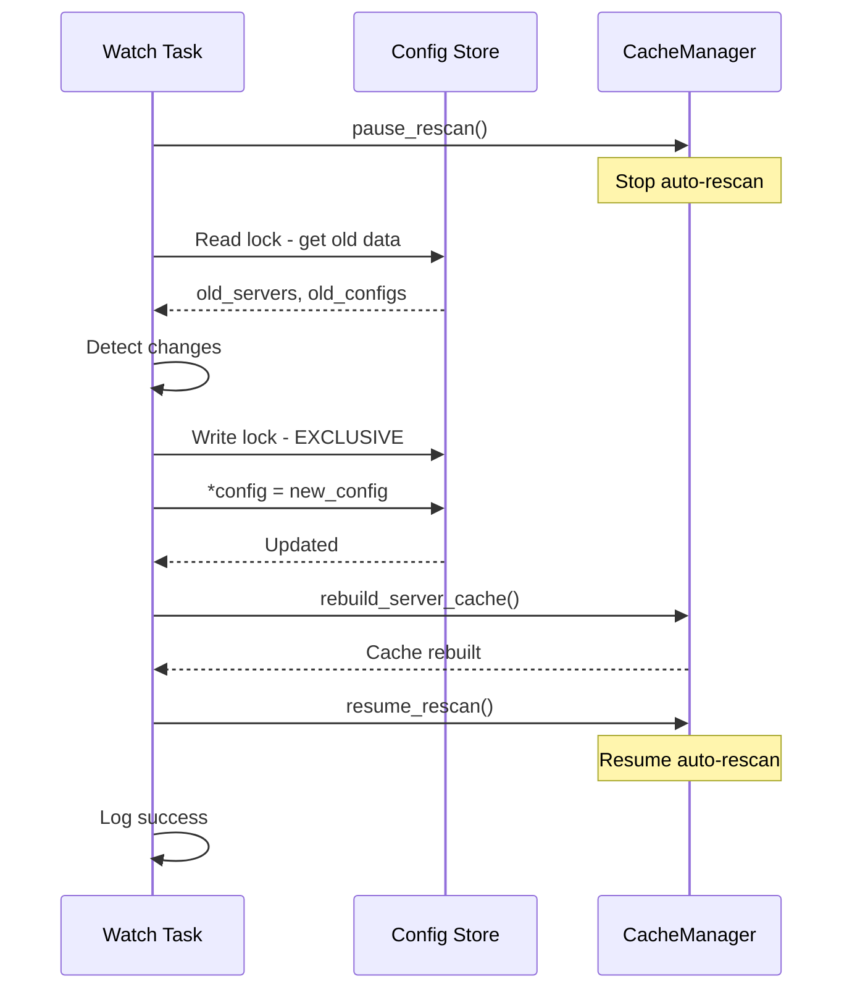

## Modified Servers Processing

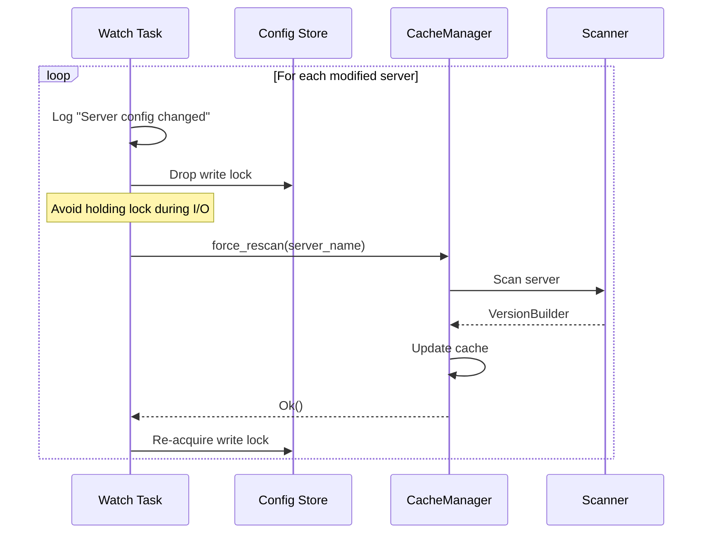

## Added Servers Processing

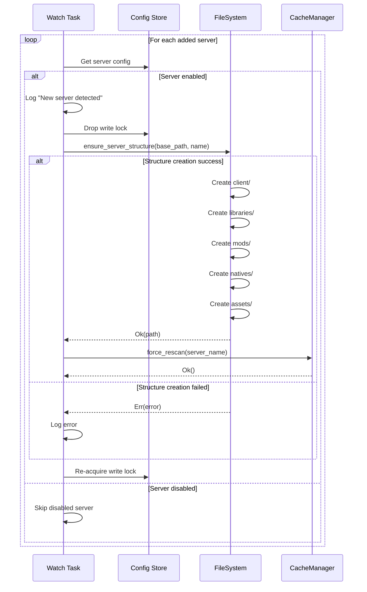

## File Existence Verification

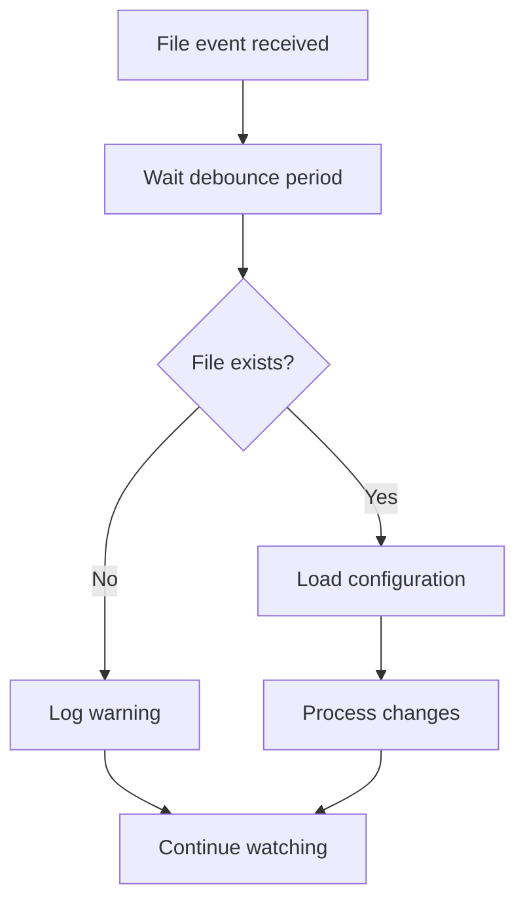

## Error Handling During Reload

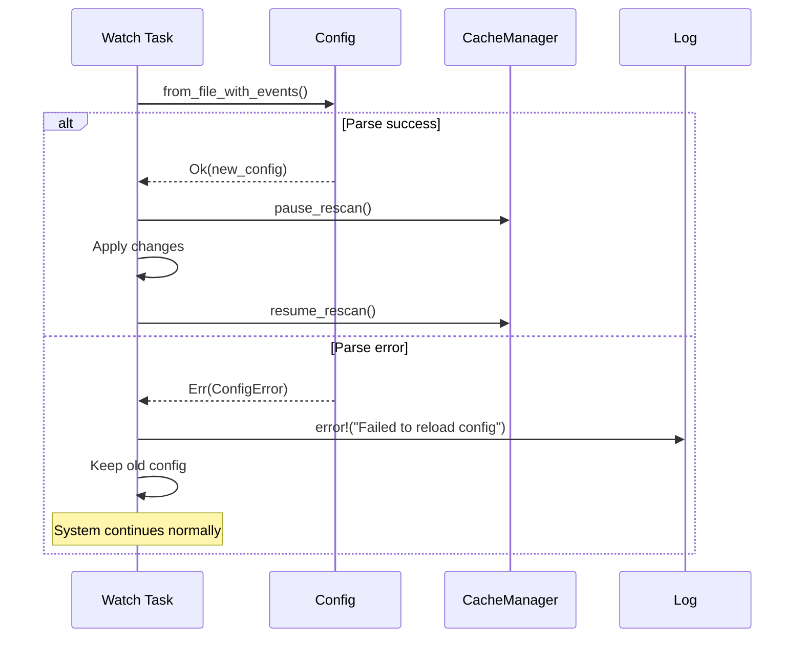

## Lock Release Pattern for I/O

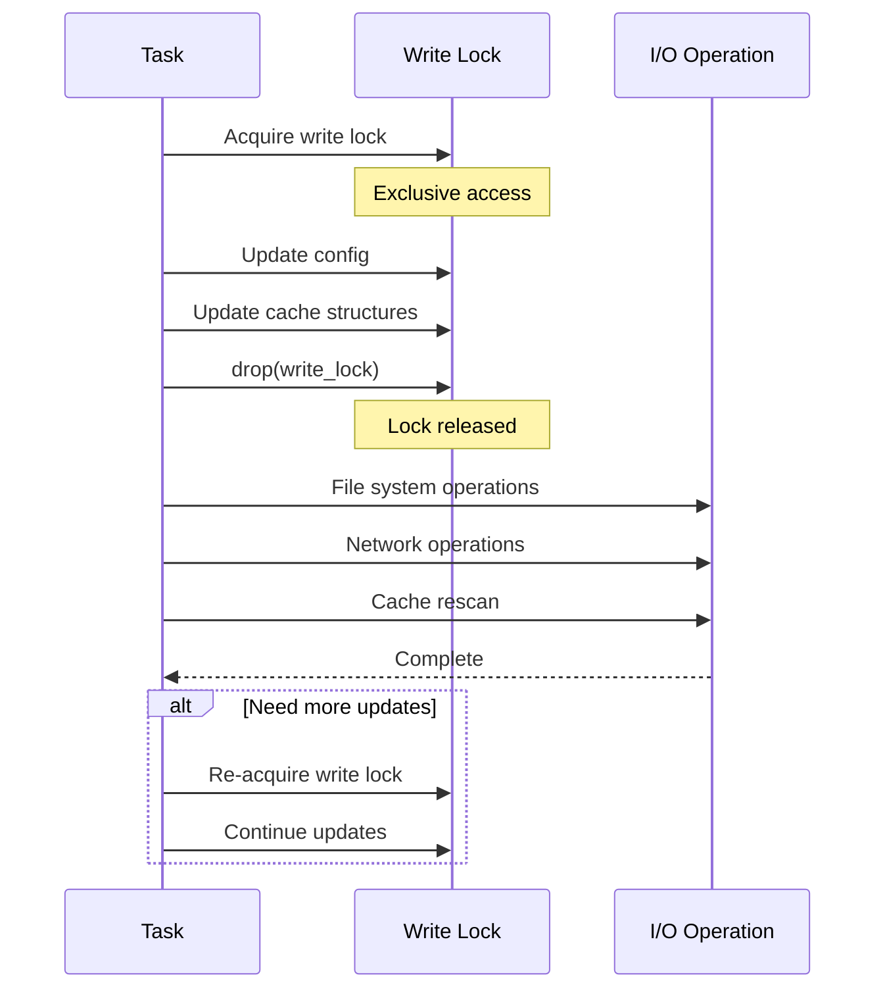

## Complete Reload Cycle

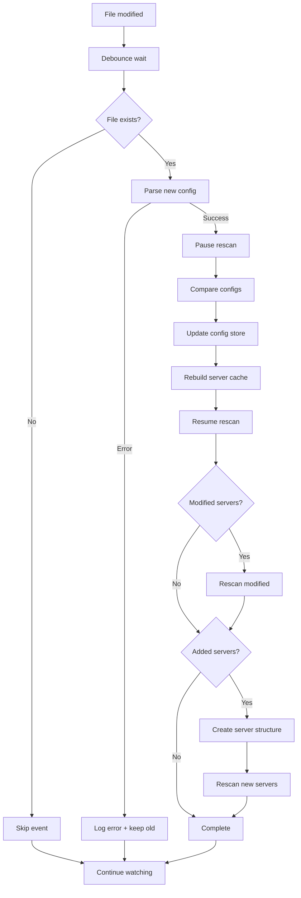

## Performance Metrics

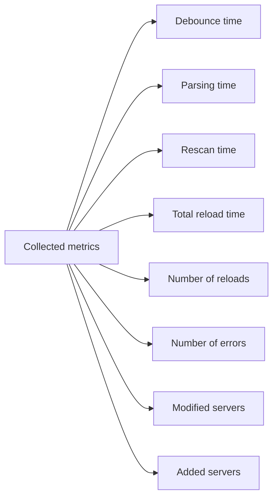

Typical times:
- Debounce: 100-500ms (configurable)
- Config parsing: 1-10ms
- Cache rebuild: 5-20ms
- Rescan per server: 100ms-2s
- Total: 200ms-5s depending on number of servers
