# Hot-Reload Mechanism

## Overview

Hot-reload allows modifying the server configuration without restart, with automatic update of all affected components.

## Hot-Reload Architecture

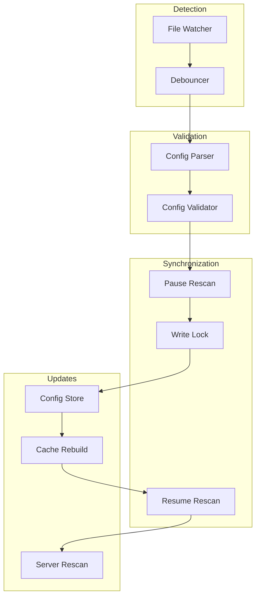

## Hot-Reload Phases

### Phase 1: Detection

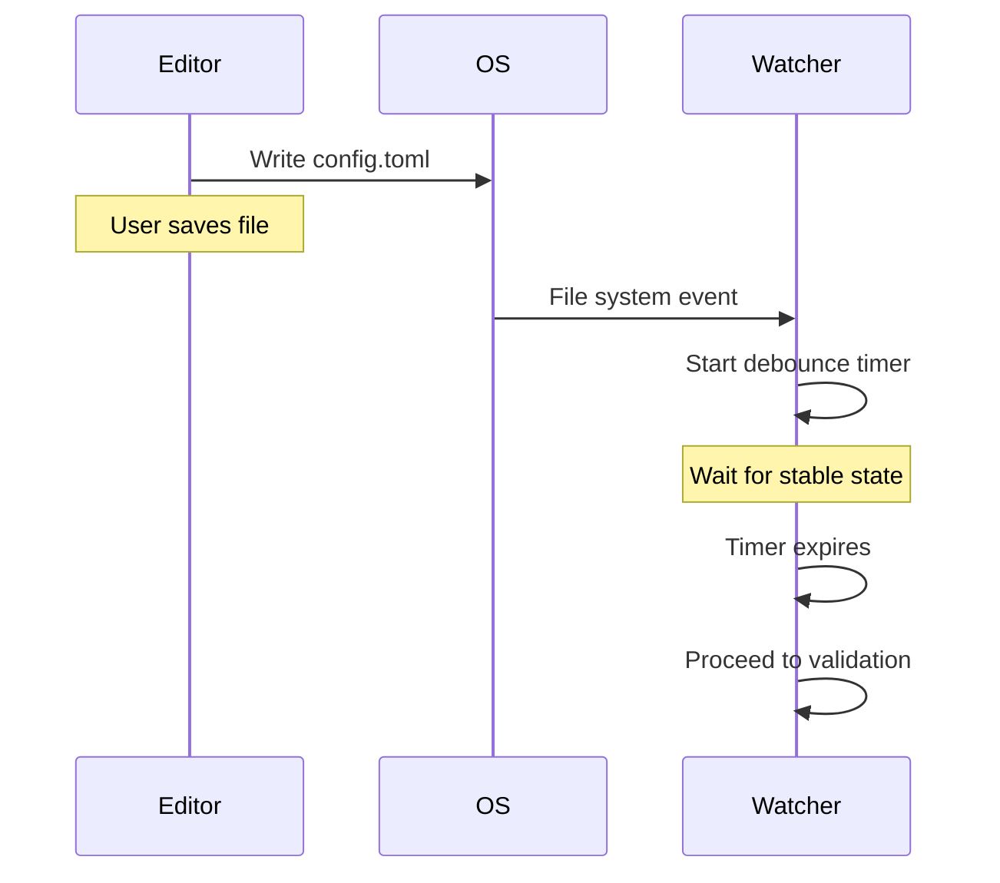

**Debouncing:**
- Avoids multiple reloads during successive saves
- Configurable delay (default: 500ms)
- Timer reset on each new event

### Phase 2: Validation

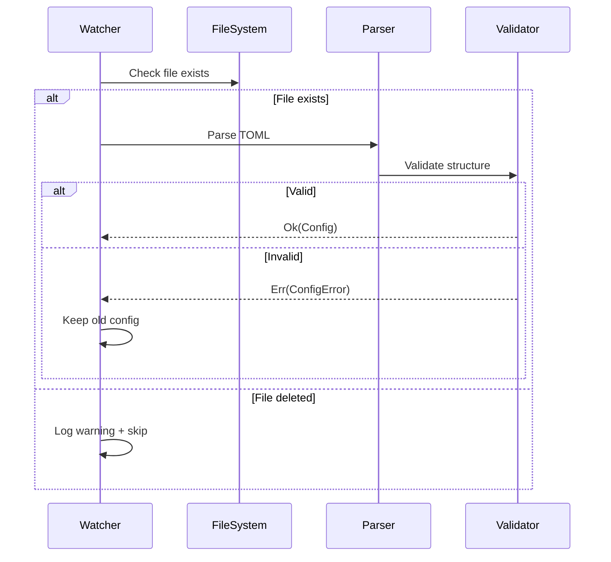

**Validation including:**
- Correct TOML syntax
- Required fields present
- Correct data types
- Values within acceptable limits
- Logical configuration consistency

### Phase 3: Synchronization

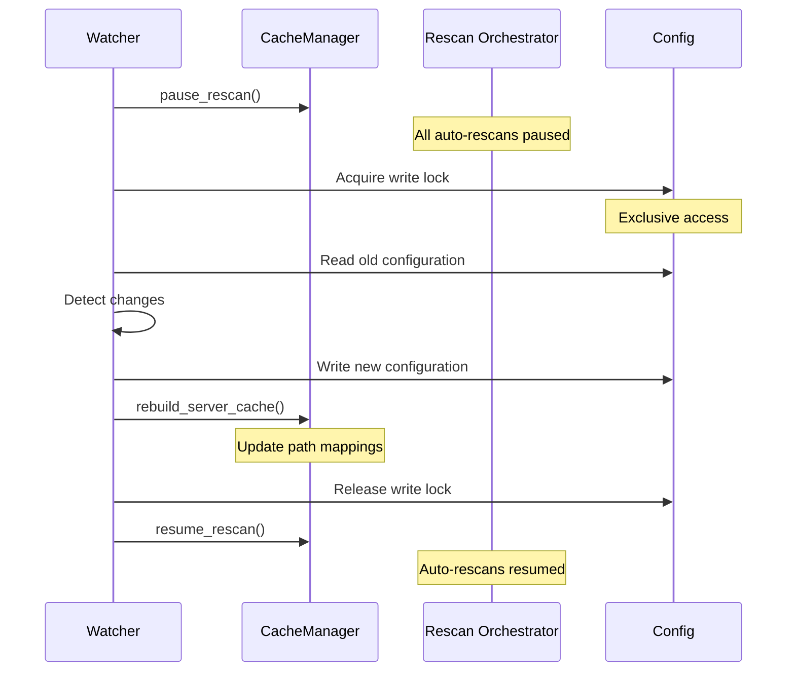

**Guarantees:**
- No automatic rescan during update
- Exclusive access to configuration
- Update atomicity
- Guaranteed cache consistency

### Phase 4: Applying Changes

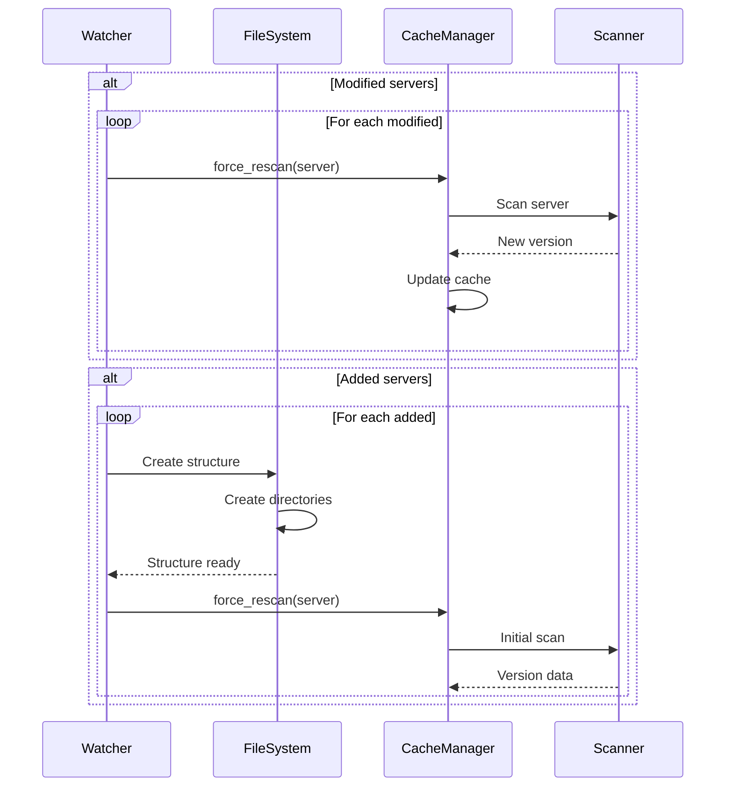

## Server Management

### Added Server

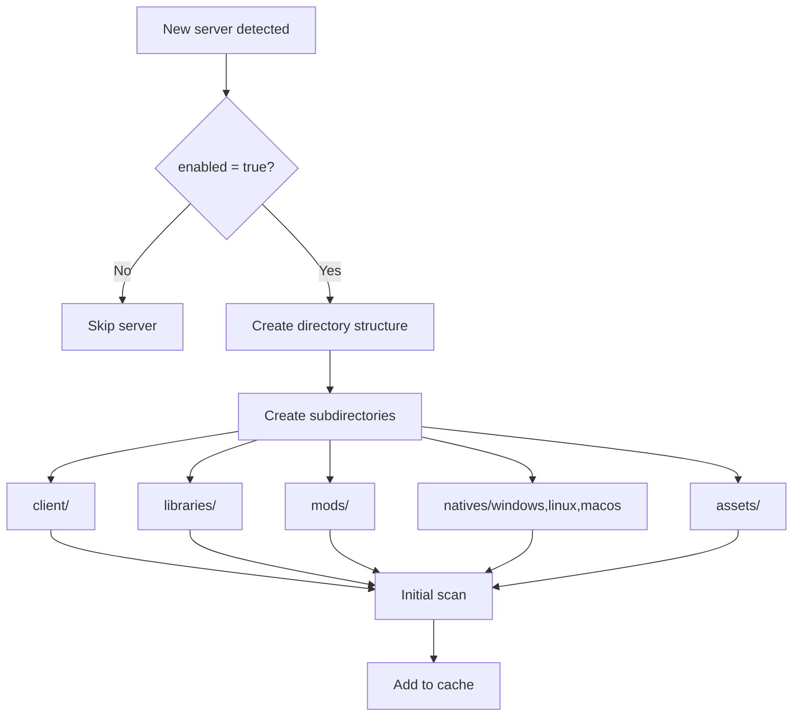

### Modified Server

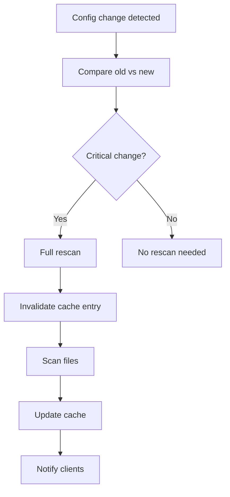

**Critical changes:**
- Modified Minecraft version
- Loader change
- Activated/deactivated components

**Non-critical changes:**
- Name modification (display_name)
- Description change
- Metadata update

### Removed Server

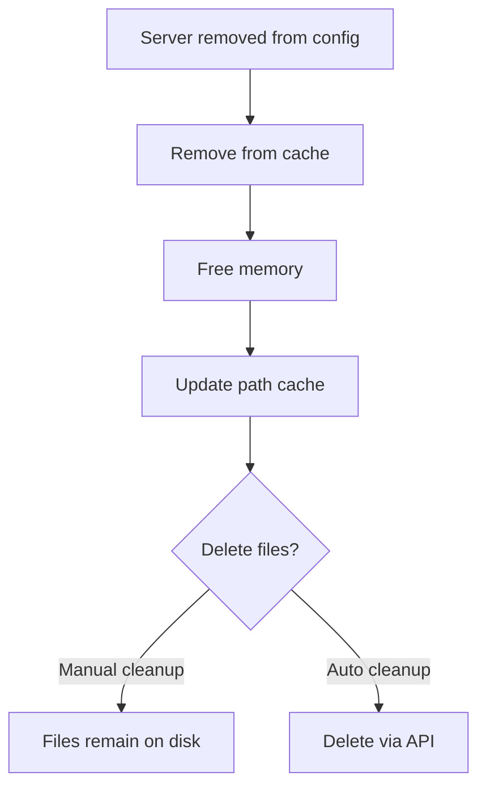

**Current behavior:**
- Files kept on disk
- Memory cache cleaned
- Path mappings updated
- No automatic deletion

## Race Condition Prevention

### Problem Without Synchronization

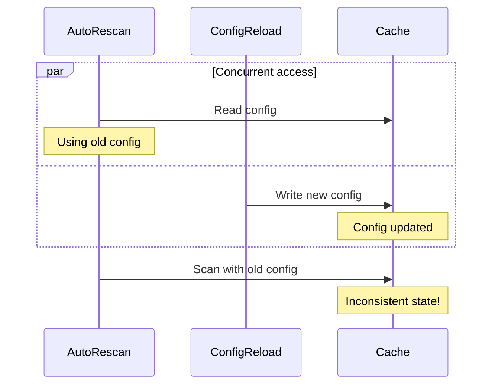

### Solution avec pause/resume

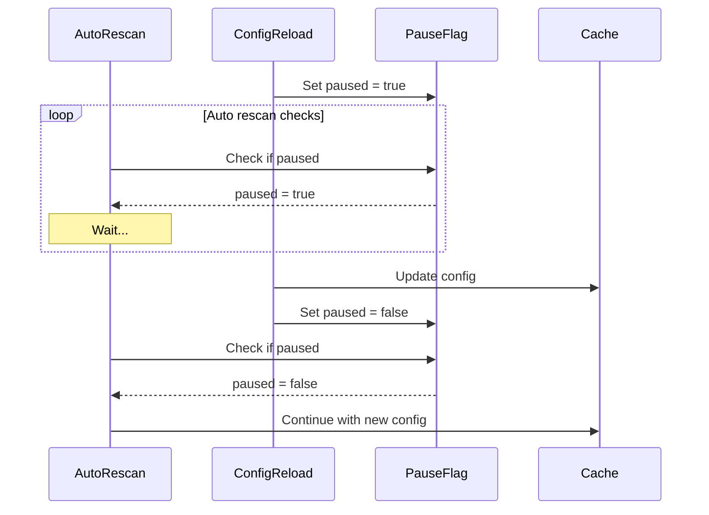

## System Impact

### During Reload

**Paused operations:**
- Periodic automatic rescan
- File watcher triggered rescan
- Automatic cache update

**Continuing operations:**
- File serving via API
- GET requests to servers
- Read access to existing cache

### After Reload

**Triggered operations:**
- Rescan of modified servers
- Initial scan of added servers
- Path cache reconstruction
- Change event emission

## Performance

### Optimizations

**Minimize lock time:**
```rust
// Acquire lock
let mut config_write = config.write().await;

// Fast operations only
*config_write = new_config;
cache_manager.rebuild_server_cache().await;

// Release immediately
drop(config_write);

// Slow I/O operations without lock
FileSystem::ensure_server_structure().await;
cache_manager.force_rescan().await;
```

**Parallelize rescans:**
```rust
// Rescan multiple servers in parallel
let tasks: Vec<_> = modified_servers
    .iter()
    .map(|server| {
        let cache = cache_manager.clone();
        let name = server.clone();
        tokio::spawn(async move {
            cache.force_rescan(&name).await
        })
    })
    .collect();

// Wait for all
futures::future::join_all(tasks).await;
```

## Observabilite

### Emitted Logs

```rust
// Reload start
tracing::info!("Configuration reloaded successfully from {}", path);

// Modified servers
tracing::info!("Server config changed, rescanning: {}", server_name);

// New servers
tracing::info!("New server detected: {}", server_name);

// Errors
tracing::error!("Failed to reload config: {}", error);
```

### Metrics

- Number of successful reloads
- Number of failed reloads
- Average reload time
- Number of modified servers per reload
- Number of added servers per reload

## Use Cases

### Development Workflow

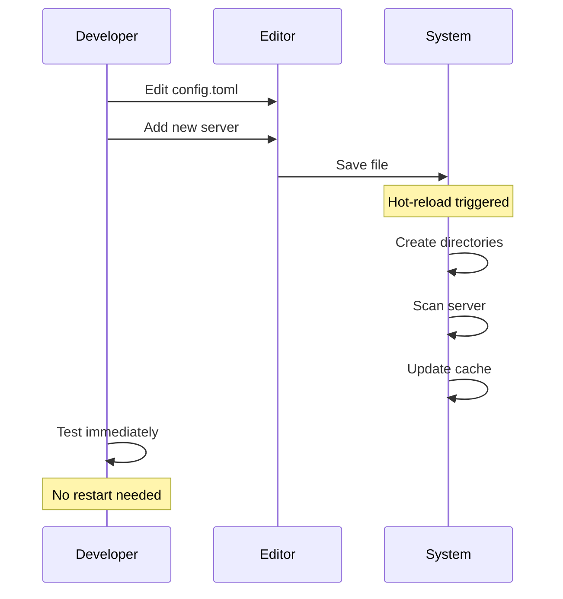

### Production Update

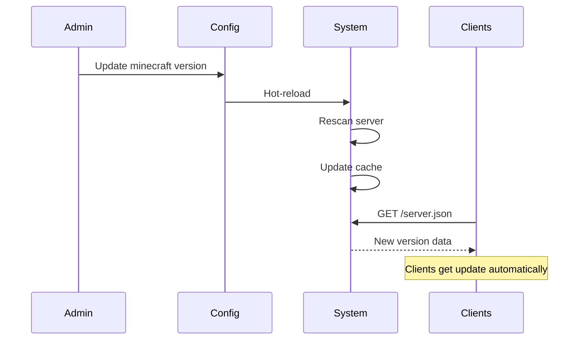

## Limitations

**No automatic rollback:**
- If new config invalid, old one remains active
- No config version system
- No automatic snapshot

**No semantic validation:**
- Checks syntax, not business logic
- Doesn't check if files exist
- Doesn't validate Minecraft versions

**Impact on clients:**
- Connected clients are not notified
- Must re-fetch to see changes
- No websocket or SSE for push updates
