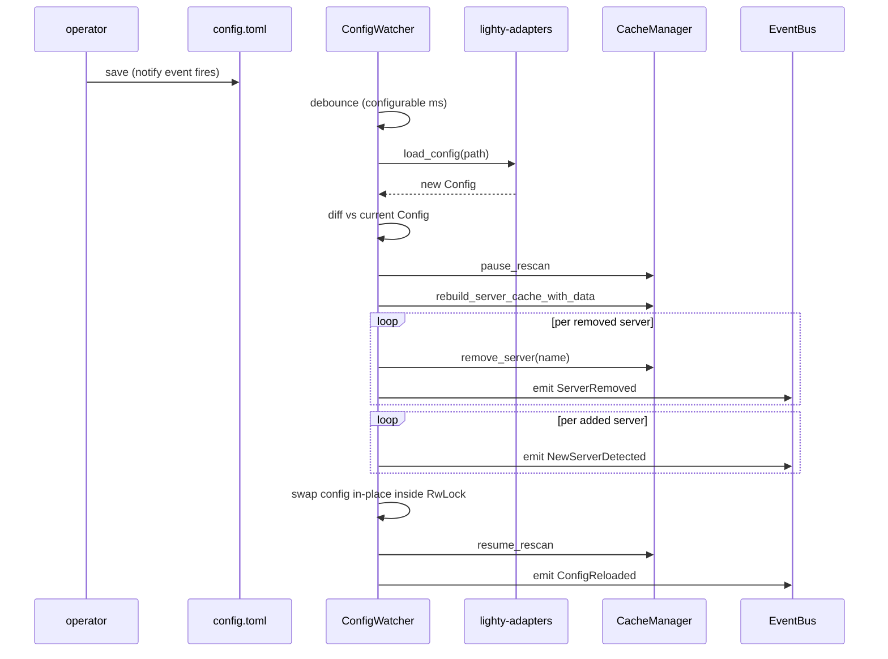

# Overview

`lighty-watcher` does one thing: react to `config.toml` changing on
disk. When the operator edits the file, the watcher reloads it,
diffs against the previous snapshot, and walks the cache through the
state transitions (servers added, removed, renamed).

It does **not** watch server data folders — that's the file-watcher
loop inside `lighty-rescan`. Two separate concerns, two separate
watchers.

## What's inside

| Module / type | Purpose |
|---|---|
| `ConfigWatcher` | Holds the `Arc<RwLock<Config>>`, the config path and the `Arc<CacheManager>`. `start_watching` spawns a tokio task that owns a `notify::Watcher`. |
| `ConfigDiff` | Internal — categorises added / removed / mutated servers between the old and new config. |
| `WatcherError` | One enum; `#[from]` for `io`, `notify::Error`, `AdaptersError`. |

## Reload flow

## Design notes

- **Debounce.** A single save event can produce a burst on some
  filesystems; the watcher waits a short window before reacting.
- **Pause-rebuild-resume.** Rescan must be paused so a swapped server
  config can't be read by an in-flight scan. The rebuild populates
  the new `ServerPathCache` before resume.
- **Removal is destructive.** Deleting a server from config calls
  `CacheManager::remove_server`, which clears the version cache, the
  file cache (prefix-based) and the server path cache. No "is this
  intentional?" guard — the operator owns `config.toml`.

## Cargo features

None.

## See also

- [`how-to-use.md`](./how-to-use.md) — start the watcher
- [`exports.md`](./exports.md) — full public surface
- [`architecture.md`](./architecture.md), [`change-detection.md`](./change-detection.md),
  [`flow.md`](./flow.md), [`hot-reload.md`](./hot-reload.md) — deeper dives
- [`../../adapters/docs/overview.md`](../../adapters/docs/overview.md) —
  the `load_config` it delegates to
- [`../../cache/docs/flows.md`](../../cache/docs/flows.md) — hot-reload sequence
